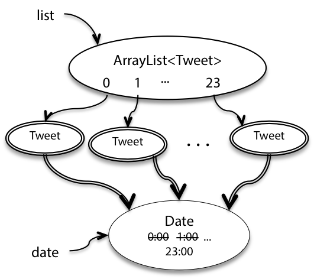
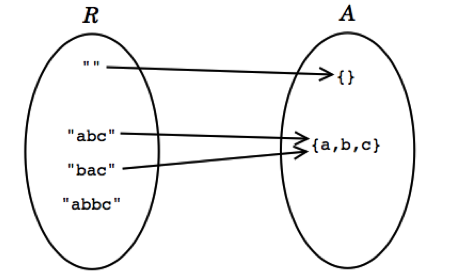

# Reading 13-Abstraction Functions & Rep Invariants

## Invariants

The final, and perhaps most important, property of a good abstract data type is that it **perserves its own invariants**.

An **invariant** is a property of a program that is always true, for every possible runtime state of the program. 

Saying that the ADT **preserves its own invariants** means that the ADT is responsible for ensuring that its own invariants hold. It doesn't depend on good behavior from its clients.

### Immutability

```java
/**
 * This immutable data type represents a tweet from Twitter.
 */
public class Tweet {

    public String author;
    public String text;
    public Date timestamp;

    /**
     * Make a Tweet.
     * @param author    Twitter user who wrote the tweet
     * @param text      text of the tweet
     * @param timestamp date/time when the tweet was sent
     */
    public Tweet(String author, String text, Date timestamp) {
        this.author = author;
        this.text = text;
        this.timestamp = timestamp;
    }
}
```

The first threat to immutability comes from the fact that clients can directly access its fields：

```java
Tweet t = new Tweet("justinbieber", 
                    "Thanks to all those beliebers out there inspiring me every day", 
                    new Date());
t.author = "rbmllr";
```

This is a trivial example of **representation exposure**, meaning that code outside the class can modify the representation directly.

Fortunately, Java gives us language mechanisms to deal with this kind of rep exposure:

- `private`
- `final`：the **reference can not be changed**

```java
public class Tweet {

    private final String author;
    private final String text;
    private final Date timestamp;

    public Tweet(String author, String text, Date timestamp) {
        this.author = author;
        this.text = text;
        this.timestamp = timestamp;
    }

    /** @return Twitter user who wrote the tweet */
    public String getAuthor() {
        return author;
    }

    /** @return text of the tweet */
    public String getText() {
        return text;
    }

    /** @return date/time when the tweet was sent */
    public Date getTimestamp() {
        return timestamp;
    }

}
```

But that is not the end of the story: the rep is still exposed! Because the `final` keyword **does not make the referenced object itself immutable**.


Consider this client code:

Consider this (again perfectly reasonable) client code:

```java
/** @return a list of 24 inspiring tweets, one per hour today */
public static List<Tweet> tweetEveryHourToday () {
    List<Tweet> list = new ArrayList<Tweet>(); 
    Date date = new Date();
    for (int i = 0; i < 24; i++) {
        date.setHours(i);
        list.add(new Tweet("rbmllr", "keep it up! you can do it", date));
    } 
    return list;
}
```



The immutability of Tweet has been violated. We can fix this problem too by using judicious **defensive copying**, this time in the constructor:

```java
public Tweet(String author, String text, Date timestamp) {
    this.author = author;
    this.text = text;
    this.timestamp = new Date(timestamp.getTime()); // defensive copying
}
```

##### Why Not Just Rely on Documentation (Specifications)?

This is sometimes seen in JavaDocs, for example:

```java
/**
 * @param timestamp date/time when the tweet was sent. Caller must never 
 *                  mutate this Date object again!
 */
public Tweet(String author, String text, Date timestamp) { ... }
```

**BUT:**

- This puts the burden on the user (the "caller") of your class.
- If anyone forgets, or if the code is reused elsewhere, accidental mutation can happen.
- It’s easy to make mistakes, especially in large codebases or when code is maintained by many people over time.

##### Even Better: Use Immutable Types

- If you use **immutable types** (objects whose state can’t change after creation), there’s no rep exposure risk!
- For dates and times in Java, use `java.time.ZonedDateTime` or other classes from the modern Java Time API, instead of the old, mutable `java.util.Date`.

### Immutable Wrappers Around Mutable Data Types

`Collections.unmodifiableList() `takes a (mutable) `List `and wraps it with an object that looks like a `List `, but whose mutators are disabled – `set() `, `add() `, `remove() `, etc. throw exceptions.

The downside here is that you get immutability at runtime, but not at compile time. Java won’t warn you at compile time if you try to `sort() `this unmodifiable list. You’ll just get an exception at runtime. 

## Rep Invariant and Abstraction Function

**Two Spaces: Rep Space vs. Abstract Space**

- **Rep Space**
  - Consists of the values of the **actual implementation entities.**
  - Example: Using a `String` to represent a set of characters.

- **Abstract Space**
  - Consists of the values that the type is designed to support. These are a figment of our imaginations.
  - Example: All possible mathematical sets of characters.

Now of course the implementor of the abstract type must be interested in the representation values, since it is the implementor’s job to achieve the illusion of the abstract value space using the rep value space.

Suppose, for example, that we choose to use a string to represent a set of characters:

```java
public class CharSet {
    private String s;
    ...
}
```



Then the rep space R contains Strings, and the abstract space A is mathematical sets of characters. There are several things to note about this picture:

- **Every abstract value is mapped to by some rep value** . The purpose of implementing the abstract type is to support operations on abstract values. Presumably, then, we will need to be able to create and manipulate all possible abstract values, and they must therefore be representable.
- **Some abstract values are mapped to by more than one rep value** . This happens because the representation isn’t a tight encoding. There’s more than one way to represent an unordered set of characters as a string.
- **Not all rep values are mapped** . In this case, the string “abbc” is not mapped. In this case, we have decided that the string should not contain duplicates. This will allow us to terminate the remove method when we hit the first instance of a particular character, since we know there can be at most one.

1. An *abstraction function* that maps rep values to the abstract values they represent:

> AF : R → A

The arcs in the diagram show the abstraction function. In the terminology of functions, the properties we discussed above can be expressed by saying that the function is surjective (also called *onto* ), not necessarily injective ( *one-to-one* ) and therefore not necessarily bijective, and often partial.

2. A *rep invariant* that maps rep values to booleans:

> RI : R → boolean

For a rep value *r* , *RI(r)* is true if and only if *r* is mapped by *AF* . In other words, *RI* tells us whether a given rep value is well-formed. Alternatively, you can think of *RI* as a set: **it’s the subset of rep values on which *AF* is defined.**

The essential point is that designing an abstract type means **not only choosing the two spaces** – the abstract value space for the specification and the rep value space for the implementation – **but also deciding what rep values to use and how to interpret them** .

Three different AFs and RIs, but their rep space and abstract space are the same:

```java
public class CharSet {
    private String s;
    // Rep invariant:
    //    s contains no repeated characters
    // Abstraction Function:
    //   represents the set of characters found in s
    ...
}
```

```java
public class CharSet {
    private String s;
    // Rep invariant:
    //    s[0] <= s[1] <= ... <= s[s.length()-1]
    // Abstraction Function:
    //   represents the set of characters found in s
    ...
}
```

```java
public class CharSet {
    private String s;
    // Rep invariant:
    //    s.length is even
    //    s[0] <= s[1] <= ... <= s[s.length()-1]
    // Abstraction Function:
    //   represents the union of the ranges
    //   {s[i]...s[i+1]} for each adjacent pair of characters 
    //   in s
    ...
}
```

### Example: Rational Numbers

Here’s an example of an abstract data type for rational numbers. Look closely at its rep invariant and abstraction function.

```java
public class RatNum {

    private final int numer;
    private final int denom;

    // Rep invariant:
    //   denom > 0
    //   numer/denom is in reduced form

    // Abstraction Function:
    //   represents the rational number numer / denom

    /** Make a new Ratnum == n.
     *  @param n value */
    public RatNum(int n) {
        numer = n;
        denom = 1;
        checkRep();
    }

    /** Make a new RatNum == (n / d).
     *  @param n numerator
     *  @param d denominator
     *  @throws ArithmeticException if d == 0 */
    public RatNum(int n, int d) throws ArithmeticException {
        // reduce ratio to lowest terms
        int g = gcd(n, d);
        n = n / g;
        d = d / g;

        // make denominator positive
        if (d < 0) {
            numer = -n;
            denom = -d;
        } else {
            numer = n;
            denom = d;
        }
        checkRep();
    }
}
```

Here is a picture of the abstraction function and rep invariant for this code. The RI requires that numerator/denominator pairs be in reduced form (i.e., lowest terms), so pairs like (2,4) and (18,12) above should be drawn as outside the RI.

It would be completely reasonable to design another implementation of this same ADT with a more permissive RI. With such a change, some operations might become more expensive to perform, and others cheaper.


### Checking the Rep Invariant

The rep invariant isn’t just a neat mathematical idea. If your implementation asserts the rep invariant at run time, then you can catch bugs early. Here’s a method for `RatNum `that tests its rep invariant:

```java
// Check that the rep invariant is true
// *** Warning: this does nothing unless you turn on assertion checking
// by passing -enableassertions to Java
private void checkRep() {
    assert denom > 0;
    assert gcd(numer, denom) == 1;
}
```

You should certainly call `checkRep() `to assert the rep invariant at the end of every operation that creates or mutates the rep – in other words, creators, producers, and mutators. Look back at the `RatNum `code above, and you’ll see that it calls `checkRep() `at the end of both constructors.

Observer methods don’t normally need to call `checkRep() `, but it’s good defensive practice to do so anyway. Why? Calling `checkRep() `in every method, including observers, means you’ll be more likely to catch rep invariant violations caused by rep exposure.

Why is `checkRep `private? Who should be responsible for checking and enforcing a rep invariant – clients, or the implementation itself?

### No Null Values in the Rep

Every reference in your representation must be non-null in mit6.005. 

Always enforce this in your `checkRep()` method, either explicitly or implicitly through your checks.

## Documenting the AF, RI, and Safety from Rep Exposure

It’s good practice to document the abstraction function and rep invariant in the class, using comments right where the private fields of the rep are declared. We’ve been doing that above.

Another piece of documentation that 6.005 asks you to write is a **rep exposure safety argument** . This is a comment that examines each part of the rep, looks at the code that handles that part of the rep (particularly with respect to parameters and return values from clients, because that is where rep exposure occurs), and presents a reason why the code doesn’t expose the rep.

```java
// Immutable type representing a tweet.
public class Tweet {

    private final String author;
    private final String text;
    private final Date timestamp;

    // Rep invariant:
    //   author is a Twitter username (a nonempty string of letters, digits, underscores)
    //   text.length <= 140
    // Abstraction Function:
    //   represents a tweet posted by author, with content text, at time timestamp 
    // Safety from rep exposure:
    //   All fields are private;
    //   author and text are Strings, so are guaranteed immutable;
    //   timestamp is a mutable Date, so Tweet() constructor and getTimestamp() 
    //        make defensive copies to avoid sharing the rep's Date object with clients.

    // Operations (specs and method bodies omitted to save space)
    public Tweet(String author, String text, Date timestamp) { ... }
    public String getAuthor() { ... }
    public String getText() { ... }
    public Date getTimestamp() { ... }
}
```

```java
// Immutable type representing a rational number.
public class RatNum {
    private final int numer;
    private final int denom;

    // Rep invariant:
    //   denom > 0
    //   numer/denom is in reduced form, i.e. gcd(|numer|,denom) = 1
    // Abstraction Function:
    //   represents the rational number numer / denom
    // Safety from rep exposure:
    //   All fields are private, and all types in the rep are immutable.

    // Operations (specs and method bodies omitted to save space)
    public RatNum(int n) { ... }
    public RatNum(int n, int d) throws ArithmeticException { ... }
    ...
}
```

### How to Establish Invariants

An invariant is a property that is true for the entire program – which in the case of an invariant about an object, reduces to the entire lifetime of the object.

To make an invariant hold, we need to:

- make the invariant true in the initial state of the object; and
- ensure that all changes to the object keep the invariant true.

Translating this in terms of the types of ADT operations, this means:

- creators and producers must establish the invariant for new object instances; and
- mutators and observers must preserve the invariant.

The risk of rep exposure makes the situation more complicated. If the rep is exposed, then the object might be changed anywhere in the program, not just in the ADT’s operations, and we can’t guarantee that the invariant still holds after those arbitrary changes. So the full rule for proving invariants is:

**Structural induction** . If an invariant of an abstract data type is

1. established by creators and producers;
2. preserved by mutators, and observers; and
3. no representation exposure occurs,

then the invariant is true of all instances of the abstract data type.

## ADT invariants replace preconditions

ADTs encapsulate important properties (invariants) within their own definitions.

When you use an ADT as a parameter or return type, you no longer need to specify detailed preconditions (like “must be sorted, no repeats”) in every method specification.

## Summary

- An **invariant** is a property that is always true of an ADT object instance, for the lifetime of the object.
- **A good ADT preserves its own invariants**. Invariants must be established by c**reators and producers, and preserved by observers and mutators.**
- The rep invariant specifies legal values of the representation, and should be checked at runtime with `checkRep() `.
- The abstraction function maps a concrete representation to the abstract value it represents.
- Representation exposure threatens both representation independence and invariant preservation.

The topics of today’s reading connect to our three properties of good software as follows:

- **Safe from bugs.** A good ADT preserves its own invariants, so that those invariants are less vulnerable to bugs in the ADT’s clients, and violations of the invariants can be more easily isolated within the implementation of the ADT itself. Stating the rep invariant explicitly, and checking it at runtime with checkRep(), catches misunderstandings and bugs earlier, rather than continuing on with a corrupt data structure.

- **Easy to understand.** Rep invariants and abstraction functions explicate the meaning of a data type’s representation, and how it relates to its abstraction.

- **Ready for change.** Abstract data types separate the abstraction from the concrete representation, which makes it possible to change the representation without having to change client code.

  