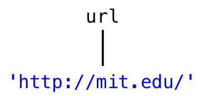
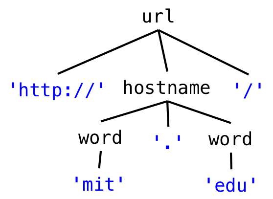
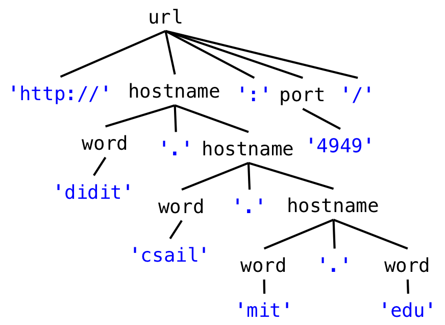

# Reading 17-Regular Expressions & Grammars

## Grammars

To describe a sequence of symbols, whether they are bytes, characters, or some other kind of symbol drawn from a fixed set, we use a compact representation called a *grammar* .

The symbols in a sentence are called *terminals* (or tokens).

A grammar is described by a set of *productions* , where each production defines a *nonterminal* .

A production in a grammar has the form

> nonterminal ::= expression of terminals, nonterminals, and operators

One of the nonterminals of the grammar is designated as the *root* . The set of sentences that the grammar recognizes are the ones that match the root nonterminal.

### Grammar Operators

The three most important operators in a production expression are:

- concatenation

```java
x ::= y z     an x is a y followed by a z 
```

- repetition

```java
x ::= y*      an x is zero or more y 
```

- union (also called alternation)

```java
x ::= y | z     an x is a y or a z 
```

You can also use additional operators which are just syntactic sugar (i.e., they’re equivalent to combinations of the big three operators):

- option (0 or 1 occurrence)

```java
x ::=  y?      an x is a y or is the empty sentence
```

- 1+ repetition (1 or more occurrences)

```java
x ::= y+       an x is one or more y
               (equivalent to  x ::= y y* )
```

- character classes

```java
x ::= [abc]  is equivalent to  x ::= 'a' | 'b' | 'c' 

x ::= [^b]   is equivalent to  x ::= 'a' | 'c' | 'd' | 'e' | 'f' 
                                         | ... (all other characters)
```

By convention, the operators `* `, `? `, and `+ `have highest precedence, which means they are applied first. Alternation `| `has lowest precedence, which means it is applied last. Parentheses can be used to override this precedence, so that a sequence or alternation can be repeated:

- grouping using parentheses

```java
x ::=  (y z | a b)*   an x is zero or more y-z or a-b pairs
```

### Example: URL

Suppose we want to write a grammar that represents URLs. Let’s build up a grammar gradually by starting with simple examples and extending the grammar as we go.

Here’s a simple URL:

```python
http://mit.edu/
```

A grammar that represents the set of sentences containing *only this URL* would look like:

```python
url ::= 'http://mit.edu/'
```

But let’s generalize it to capture other domains, as well:

```python
http://stanford.edu/
http://google.com/
```

We can write this as one line, like this:



```python
url ::= 'http://' [a-z]+ '.' [a-z]+  '/'
```

This grammar represents the set of all URLs that consist of just a two-part hostname, where each part of the hostname consists of 1 or more letters. So `http://mit.edu/ `and `http://yahoo.com/ `would match, but not `http://ou812.com/ `. Since it has only one nonterminal, a *parse tree* for this URL grammar would look like the picture on the right.

In this one-line form, with a single nonterminal whose production uses only operators and terminals, a grammar is called a *regular expression* (more about that later). But it will be easier to understand if we name the parts using new nonterminals:



```python
url ::= 'http://' hostname '/'
hostname ::= word '.' word
word ::= [a-z]+
```

The parse tree for this grammar is now shown at right. The tree has more structure now. The leaves of the tree are the parts of the string that have been parsed. If we concatenated the leaves together, we would recover the original string. The `hostname `and `word `nonterminals are labeling nodes of the tree whose subtrees match those rules in the grammar. Notice that the immediate children of a nonterminal node like `hostname `follow the pattern of the `hostname `rule, `word '.' word `.

How else do we need to generalize? Hostnames can have more than two components, and there can be an optional port number:

```python
http://didit.csail.mit.edu:4949/
```

To handle this kind of string, the grammar is now:



```python
url ::= 'http://' hostname (':' port)? '/' 
hostname ::= word '.' hostname | word '.' word
port ::= [0-9]+
word ::= [a-z]+
```

*Notice how hostname is now defined recursively in terms of itself.* Which part of the hostname definition is the base case, and which part is the recursive step? What kinds of hostnames are allowed?

Using the repetition operator, we could also write hostname like this:

```python
hostname ::= (word '.')+ word
```

Another thing to observe is that this grammar allows port numbers that are not technically legal, since port numbers can only range from 0 to 65535. We could write a more complex definition of port that would allow only these integers, but that’s not typically done in a grammar. Instead, the constraint 0 <= port <= 65535 would be specified alongside the grammar.

There are more things we should do to go farther:

- generalizing `http `to support the additional protocols that URLs can have
- generalizing the `/ `at the end to a slash-separated path
- allowing hostnames with the full set of legal characters instead of just a-z

## Regular Expressions

A *regular* grammar has a special property: by substituting every nonterminal (except the root one) with its righthand side, you can reduce it down to a single production for the root, with only terminals and operators on the right-hand side.

Our URL grammar was regular. By replacing nonterminals with their productions, it can be reduced to a single expression:

```python
url ::= 'http://' ([a-z]+ '.')+ [a-z]+ (':' [0-9]+)? '/' 
```

The Markdown grammar is also regular:

```python
markdown ::= ([^_]* | '_' [^_]* '_' )*
```

But our HTML grammar can’t be reduced completely. By substituting righthand sides for nonterminals, you can eventually reduce it to something like this:

```
html ::=  ( [^<>]* | '<i>' html '</i>' ) *
```

…but the recursive use of `html `on the righthand side can’t be eliminated, and can’t be simply replaced by a repetition operator either. So the HTML grammar is not regular.

The reduced expression of terminals and operators can be written in an even more compact form, called a *regular expression* . A regular expression does away with the quotes around the terminals, and the spaces between terminals and operators, so that it consists just of terminal characters, parentheses for grouping, and operator characters. For example, the regular expression for our `markdown `format is just

```python
([^_]*|_[^_]*_)*
```

Regular expressions are also called *regexes* for short. A regex is far less readable than the original grammar, because it lacks the nonterminal names that documented the meaning of each subexpression. But a regex is fast to implement, and there are libraries in many programming languages that support regular expressions.

The regex syntax commonly implemented in programming language libraries has a few more special operators, in addition to the ones we used above in grammars. Here’s are some common useful ones:

```python
.       any single character

\d      any digit, same as [0-9]
\s      any whitespace character, including space, tab, newline
\w      any word character, including letters and digits

\., \(, \), \*, \+, ...
        escapes an operator or special character so that it matches literally
```

Using backslashes is important whenever there are terminal characters that would be confused with special characters. Because our `url `regular expression has `. `in it as a terminal, we need to use a backslash to escape it:

```python
http://([a-z]+\.)+[a-z]+(:[0-9]+)/
```

### Using regular expressions in Java

Regular expressions (“regexes”) are widely used in programming, and you should have them in your toolbox.

In Java, you can use regexes for manipulating strings (see [`String.split `](https://docs.oracle.com/javase/8/docs/api/java/lang/String.html#split-java.lang.String-), [`String.matches `](https://docs.oracle.com/javase/8/docs/api/java/lang/String.html#matches-java.lang.String-), [`java.util.regex.Pattern `](https://docs.oracle.com/javase/8/docs/api/java/util/regex/Pattern.html)). They’re built-in as a first-class feature of modern scripting languages like Python, Ruby, and Javascript, and you can use them in many text editors for find and replace. Regular expressions are your friend! Most of the time. Here are some examples.

Replace all runs of spaces with a single space:

```java
String singleSpacedString = string.replaceAll(" +", " ");
```

Match a URL:

```java
Pattern regex = Pattern.compile("http://([a-z]+\\.)+[a-z]+(:[0-9]+)?/");
Matcher m = regex.matcher(string);
if (m.matches()) {
    // then string is a url
}
```

Extract part of an HTML tag:

```java
Pattern regex = Pattern.compile("<a href=['\"]([^']*)['\"]>");
Matcher m = regex.matcher(string);
if (m.matches()) {
    String url = m.group(1); 
    // Matcher.group(n) returns the nth parenthesized part of the regex
}
```

Notice the backslashes in the URL and HTML tag examples. In the URL example, we want to match a literal period `. `, so we have to first escape it as `\. `to protect it from being interpreted as the regex match-any-character operator, and then we have to further escape it as `\\. `to protect the backslash from being interpreted as a Java string escape character. In the HTML example, we have to escape the quote mark `" `as `\" `to keep it from ending the string. The frequency of backslash escapes makes regexes still less readable.

