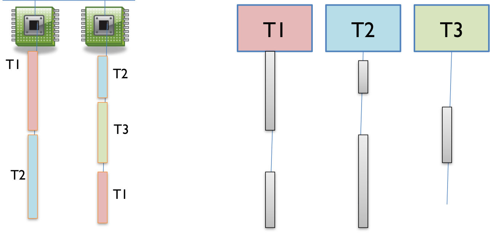

# Reading 19-Concurrency

## Concurrency

**Concurrency** means multiple computations are happening at the same time.

- Multiple computers in a network
- Multiple applications running on one computer
- Multiple processors in a computer 

In fact, concurrency is essential in modern programming:

- Web sites must handle multiple simultaneous users.
- Mobile apps need to do some of their processing on servers
- Graphical user interfaces almost always require background work that does not interupt the user.

## Two Models for Concurrent Programming

#### Shared memory


In the shared memory model of concurrency, concurrent modules interact by reading and writing shared objects in memory.

Examples of the shared-memory model:

- A and B might be **two processors** in the same computer, sharing the same **physical memory**.
- A and B might be **two programs** running on the same computer, sharing a common **filesystem** with files they can read and write.
- A and B might be **two threads** in the same Java program (We'll explain what a thread is below), sharing the same **Java objects**.

#### Message passing

In the message-passing model, concurrent modules interact by sending messages to each other through a communication channel. Modules send off messages, and incoming messages to each module are queued up for handling. Examples include:

- A and B might be **two computers in a network**, communicating by **network connections.**
- A and B might be **a web browser and a web server** – A opens a connection to B and asks for a web page, and B sends the web page data back to A.
- A and B might be an **instant messaging client and server**.
- A and B might be two programs running on the same computer whose input and output have been connected by a pipe, like `ls | grep `typed into a command prompt.

## Processes, Threads, Time-slicing

> The message-passing and shared-memory models are about how concurrent modules communicate. The concurrent modules themselves come in two different kinds: processes and threads.

#### Process

A process is an instance of running program that is **isolated** from other processes on the same machine. It has its own private section of the machine's memory.

> The process abstraction is a *virtual computer* . It makes the program feel like it has the entire machine to itself – like a fresh computer has been created, with fresh memory, just to run that program.

A process can’t access another process’s memory or objects at all. **Sharing memory between processes is *possible*** on most operating systems, but it **needs special effort**. 

By contrast, **a new process is automatically ready for message passing**, because it is created with standard input & output streams, which are the `System.out `and `System.in `streams you’ve used in Java.

#### Thread

A thread is a locus of control inside a running program. Think of it as a place in the program that is being run, plus the stack of method calls that led to that place (so the thread can go back up the stack when it reaches `return `statements).

> Just as a process represents a virtual computer, the thread abstraction represents a *virtual processor* . Making a new thread simulates making a fresh processor inside the virtual computer represented by the process. This new virtual processor runs the same program and shares the same memory as other threads in the process.

**Threads are automatically ready for shared memory,** because threads share all the memory in the process. It takes special effort to get “thread-local” memory that’s private to a single thread. It’s also necessary to set up message-passing explicitly, by creating and using queue data structures. We’ll talk about how to do that in a future reading.



When there are more threads than processors, concurrency is simulated by **time slicing** , which means that the processor switches between threads.

On most systems, time slicing happens unpredictably and nondeterministically, meaning that a thread may be paused or resumed at any time.

**In the Java Tutorials, read:**

- **[Processes & Threads ](https://docs.oracle.com/javase/tutorial/essential/concurrency/procthread.html)**(just 1 page)
- **[Defining and Starting a Thread ](https://docs.oracle.com/javase/tutorial/essential/concurrency/runthread.html)**(just 1 page)

The second Java Tutorials reading shows two ways to create a thread.

- Never use their second way (subclassing `Thread `).
- Always implement the [`Runnable `](https://docs.oracle.com/javase/8/docs/api/?java/lang/Runnable.html)interface and use the `new Thread(..) `constructor.

heir example declares a named class that implements `Runnable `:

```java
public class HelloRunnable implements Runnable {
    public void run() {
        System.out.println("Hello from a thread!");
    }
}
// ... in the main method:
new Thread(new HelloRunnable()).start();
```

A very common idiom is starting a thread with an [anonymous ](https://docs.oracle.com/javase/tutorial/java/javaOO/anonymousclasses.html)`Runnable `, which eliminates the named class:

```java
new Thread(new Runnable() {
    public void run() {
        System.out.println("Hello from a thread!");
    }
}).start();
```