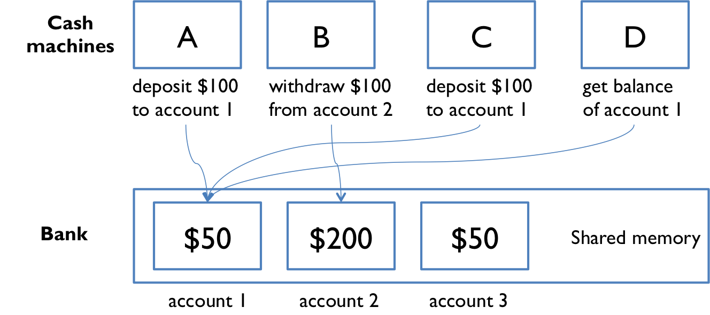

# Reading 19-Concurrency

## Concurrency

**Concurrency** means multiple computations are happening at the same time.

- Multiple computers in a network
- Multiple applications running on one computer
- Multiple processors in a computer 

In fact, concurrency is essential in modern programming:

- Web sites must handle multiple simultaneous users.
- Mobile apps need to do some of their processing on servers
- Graphical user interfaces almost always require background work that does not interupt the user.

## Two Models for Concurrent Programming

#### Shared memory


In the shared memory model of concurrency, concurrent modules interact by reading and writing shared objects in memory.

Examples of the shared-memory model:

- A and B might be **two processors** in the same computer, sharing the same **physical memory**.
- A and B might be **two programs** running on the same computer, sharing a common **filesystem** with files they can read and write.
- A and B might be **two threads** in the same Java program (We'll explain what a thread is below), sharing the same **Java objects**.

#### Message passing

In the message-passing model, concurrent modules interact by sending messages to each other through a communication channel. Modules send off messages, and incoming messages to each module are queued up for handling. Examples include:

- A and B might be **two computers in a network**, communicating by **network connections.**
- A and B might be **a web browser and a web server** – A opens a connection to B and asks for a web page, and B sends the web page data back to A.
- A and B might be an **instant messaging client and server**.
- A and B might be two programs running on the same computer whose input and output have been connected by a pipe, like `ls | grep `typed into a command prompt.

## Processes, Threads, Time-slicing

> The message-passing and shared-memory models are about how concurrent modules communicate. The concurrent modules themselves come in two different kinds: processes and threads.

#### Process

A process is an instance of running program that is **isolated** from other processes on the same machine. It has its own private section of the machine's memory.

> The process abstraction is a *virtual computer* . It makes the program feel like it has the entire machine to itself – like a fresh computer has been created, with fresh memory, just to run that program.

A process can’t access another process’s memory or objects at all. **Sharing memory between processes is *possible*** on most operating systems, but it **needs special effort**. 

By contrast, **a new process is automatically ready for message passing**, because it is created with standard input & output streams, which are the `System.out `and `System.in `streams you’ve used in Java.

#### Thread

A thread is a locus of control inside a running program. Think of it as a place in the program that is being run, plus the stack of method calls that led to that place (so the thread can go back up the stack when it reaches `return `statements).

> Just as a process represents a virtual computer, the thread abstraction represents a *virtual processor* . Making a new thread simulates making a fresh processor inside the virtual computer represented by the process. This new virtual processor runs the same program and shares the same memory as other threads in the process.

**Threads are automatically ready for shared memory,** because threads share all the memory in the process. It takes special effort to get “thread-local” memory that’s private to a single thread. It’s also necessary to set up message-passing explicitly, by creating and using queue data structures. We’ll talk about how to do that in a future reading.


When there are more threads than processors, concurrency is simulated by **time slicing** , which means that the processor switches between threads.

On most systems, time slicing happens unpredictably and nondeterministically, meaning that a thread may be paused or resumed at any time.

**In the Java Tutorials, read:**

- **[Processes & Threads ](https://docs.oracle.com/javase/tutorial/essential/concurrency/procthread.html)**(just 1 page)
- **[Defining and Starting a Thread ](https://docs.oracle.com/javase/tutorial/essential/concurrency/runthread.html)**(just 1 page)

The second Java Tutorials reading shows two ways to create a thread.

- Never use their second way (subclassing `Thread `). Because Java only allows single inheritance.
- Always implement the [`Runnable `](https://docs.oracle.com/javase/8/docs/api/?java/lang/Runnable.html)interface and use the `new Thread(..) `constructor.

heir example declares a named class that implements `Runnable `:

```java
public class HelloRunnable implements Runnable {
    public void run() {
        System.out.println("Hello from a thread!");
    }
}
// ... in the main method:
new Thread(new HelloRunnable()).start();
```

A very common idiom is starting a thread with an [anonymous ](https://docs.oracle.com/javase/tutorial/java/javaOO/anonymousclasses.html)`Runnable `, which eliminates the named class:

```java
new Thread(new Runnable() {
    public void run() {
        System.out.println("Hello from a thread!");
    }
}).start();
```

## Shared Memory Example



The point of this example is to show that concurrent programming is hard, because it can have subtle bugs. 

To illustrate what can go wrong, let's simplify the bank down to a single account, with a dollar balance stored in the `balance `variable, and two operations `deposit `and `withdraw `that simply add or remove a dollar:

```java
// suppose all the cash machines share a single bank account
private static int balance = 0;

private static void deposit() {
    balance = balance + 1;
}
private static void withdraw() {
    balance = balance - 1;
}
```

Customers use the cash machines to do transactions like this:

```java
deposit(); // put a dollar in
withdraw(); // take it back out
```

In this simple example, every transaction is just a one dollar deposit followed by a one-dollar withdrawal, **so it should leave the balance in the account unchanged**. Throughout the day, each cash machine in our network is processing a sequence of deposit/withdraw transactions.

```java
// each ATM does a bunch of transactions that
// modify balance, but leave it unchanged afterward
private static void cashMachine() {
    for (int i = 0; i < TRANSACTIONS_PER_MACHINE; ++i) {
        deposit(); // put a dollar in
        withdraw(); // take it back out
    }
}
```

So at the end of the day, regardless of how many cash machines were running, or how many transactions we processed, we should expect the account balance to still be 0.

**But if we run this code, we discover frequently that the balance at the end of the day is *not* 0.** If more than one `cashMachine() `call is running at the same time – say, on separate processors in the same computer – then `balance `may not be zero at the end of the day. Why not?

## Interleaving

Here’s one thing that can happen. Suppose two cash machines, A and B, are both working on a deposit at the same time. Here’s how the `deposit() `step typically breaks down into low-level processor instructions:

| get balance (balance=0)           |
| --------------------------------- |
| add 1                             |
| write back the result (balance=1) |

When A and B are running concurrently, these low-level instructions interleave with each other (some might even be simultaneous in some sense, but let’s just worry about interleaving for now):

| A                                   | B                                   |
| :---------------------------------- | :---------------------------------- |
| A get balance (balance=0)           |                                     |
| A add 1                             |                                     |
| A write back the result (balance=1) |                                     |
|                                     | B get balance (balance=1)           |
|                                     | B add 1                             |
|                                     | B write back the result (balance=2) |

This interleaving is fine – we end up with balance 2, so both A and B successfully put in a dollar. But what if the interleaving looked like this:

| A                                   | B                                   |
| :---------------------------------- | :---------------------------------- |
| A get balance (balance=0)           |                                     |
|                                     | B get balance (balance=0)           |
| A add 1                             |                                     |
|                                     | B add 1                             |
| A write back the result (balance=1) |                                     |
|                                     | B write back the result (balance=1) |

The balance is now 1 – A’s dollar was lost! A and B both read the balance at the same time, computed separate final balances, and then raced to store back the new balance – which failed to take the other’s deposit into account.

## Race Condition

This is an example of a **race condition** . **A race condition means that the correctness of the program (the satisfaction of postconditions and invariants) depends on the relative timing of events in concurrent computations A and B. When this happens, we say “A is in a race with B.”**

Some interleavings of events may be OK, in the sense that they are consistent with what a single, nonconcurrent process would produce, but other interleavings produce wrong answers – violating postconditions or invariants.

> you can’t tell by looking at an expression whether it will be safe from race conditions.

## Reordering

In fact, when you’re using multiple variables and multiple processors, you can’t even count on changes to those variables appearing in the same order.

Here’s an example. Note that it uses a loop that continuously checks for a concurrent condition; this is called [busy waiting ](https://en.wikipedia.org/wiki/Busy_waiting)and it is not a good pattern. In this case, the code is also broken:

```java
private boolean ready = false;
private int answer = 0;

// computeAnswer runs in one thread
private void computeAnswer() {
    answer = 42;
    ready = true;
}

// useAnswer runs in a different thread
private void useAnswer() {
    while (!ready) {
        Thread.yield();
    }
    if (answer == 0) throw new RuntimeException("answer wasn't ready!");
}
```

We have two methods that are being run in different threads：

- `computeAnswer `does a long calculation, finally coming up with the answer 42, which it puts in the answer variable. Then it sets the `ready `variable to true, in order to signal to the method running in the other thread, `useAnswer `, that the answer is ready for it to use. Looking at the code, `answer `is set before `ready `is set, so once `useAnswer `sees `ready `as true, then it seems reasonable that it can assume that the `answer `will be 42, right? Not so.

The problem is that modern compilers and processors do a lot of things to make the code fast. One of those things is making temporary copies of variables like answer and ready in faster storage (registers or caches on a processor), and working with them temporarily before eventually storing them back to their official location in memory. 

**The storeback may occur in a different order than the variables were manipulated in your code.** Here’s what might be going on under the covers (but expressed in Java syntax to make it clear). The processor is effectively creating two temporary variables, `tmpr `and `tmpa `, to manipulate the fields `ready `and `answer `:

```java
private void computeAnswer() {
    boolean tmpr = ready;
    int tmpa = answer;

    tmpa = 42;
    tmpr = true;

    ready = tmpr;
                   // <-- what happens if useAnswer() interleaves here?
                   // ready is set, but answer isn't.
    answer = tmpa;
}
```

## Message Passing Example


Now let’s look at the message-passing approach to our bank account example.

Now not only are the cash machine modules, but the accounts are modules, too. Modules interact by sending messages to each other. Incoming requests are placed in a queue to be handled one at a time. The sender doesn’t stop working while waiting for an answer to its request. It handles more requests from its own queue. The reply to its request eventually comes back as another message.

**Unfortunately, message passing doesn’t eliminate the possibility of race conditions.** Suppose each account supports `get-balance `and `withdraw `operations, with corresponding messages. Two users, at cash machines A and B, are both trying to withdraw a dollar from the same account. They check the balance first to make sure they never withdraw more than the account holds, because overdrafts trigger big bank penalties:

```
get-balance
if balance >= 1 then withdraw 1
```

The problem is again interleaving, but this time interleaving of the *messages* sent to the bank account, rather than the *instructions* executed by A and B. 

- If both A and B check the balance at nearly the same time (when the account has only 1 dollar) **both might see a balance of 1 dollar**.
- Both then send `withdraw 1` messages.
- If the account processes these messages one after the other, **both withdrawals succeed**, overdrawing the account.

> One lesson here is that you need to carefully choose the operations of a message-passing model. `withdraw-if-sufficient-funds `would be a better operation than just `withdraw `. **(a single atomic operation )**

## Concurrency is Hard to Test and Debug

It’s very hard to discover race conditions using testing. And even once a test has found a bug, it may be very hard to localize it to the part of the program causing it.

**Concurrency bugs have poor reproducibility**: They rarely occur the same way twice, because the interleaving of instructions or messages depends on timing influenced by many environmental factors (other programs, network traffic, OS scheduling, CPU speed, etc.).

- **Heisenbug**: A concurrency bug that is non-deterministic and hard to reproduce; it may even disappear when you try to observe it (e.g., with print statements or a debugger), because these operations slow down the program enough to change the timing and interleaving.

- **Bohrbug**: A bug that consistently appears every time you look for it (most bugs in sequential programming).

A heisenbug may even disappear when you try to look at it with `println `or `debugger `! The reason is that printing and debugging are so much slower than other operations, often 100-1000x slower, that they dramatically change the timing of operations, and the interleaving. So inserting a simple print statement into the cashMachine():

```java
private static void cashMachine() {
    for (int i = 0; i < TRANSACTIONS_PER_MACHINE; ++i) {
        deposit(); // put a dollar in
        withdraw(); // take it back out
        System.out.println(balance); // makes the bug disappear!
    }
}
```

…and suddenly the balance is always 0, as desired, and the bug appears to disappear. But it’s only masked, not truly fixed. A change in timing somewhere else in the program may suddenly make the bug come back.

## Summary

- Concurrency: multiple computations running simultaneously
- Shared-memory & message-passing paradigms
- Processes & threads
  - Process is like a virtual computer; thread is like a virtual processor
- Race conditions
  - When correctness of result (postconditions and invariants) depends on the relative timing of events

These ideas connect to our three key properties of good software mostly in bad ways. Concurrency is necessary but it causes serious problems for correctness. We’ll work on fixing those problems in the next few readings.

- **Safe from bugs.** Concurrency bugs are some of the hardest bugs to find and fix, and require careful design to avoid.
- **Easy to understand.** Predicting how concurrent code might interleave with other concurrent code is very hard for programmers to do. It’s best to design your code in such a way that programmers don’t have to think about interleaving at all.
- **Ready for change.** Not particularly relevant here.