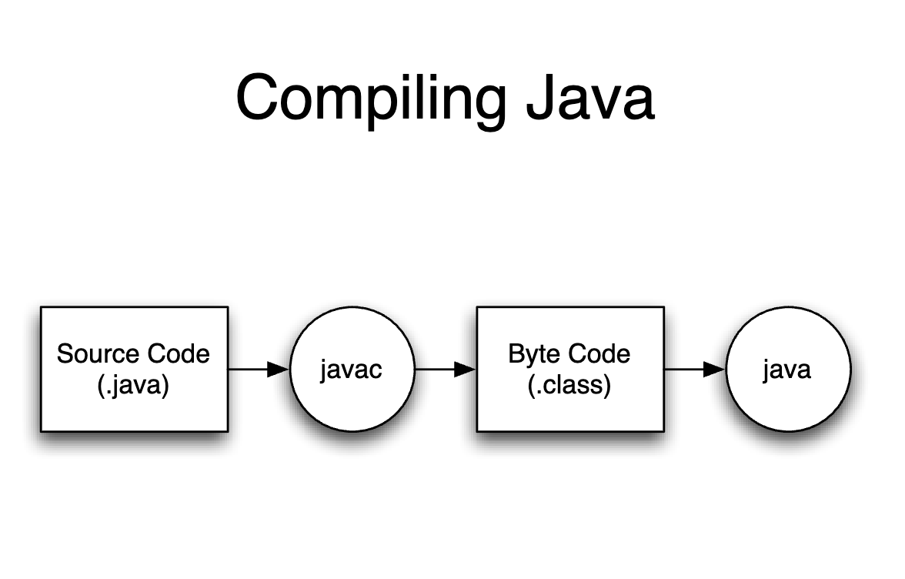
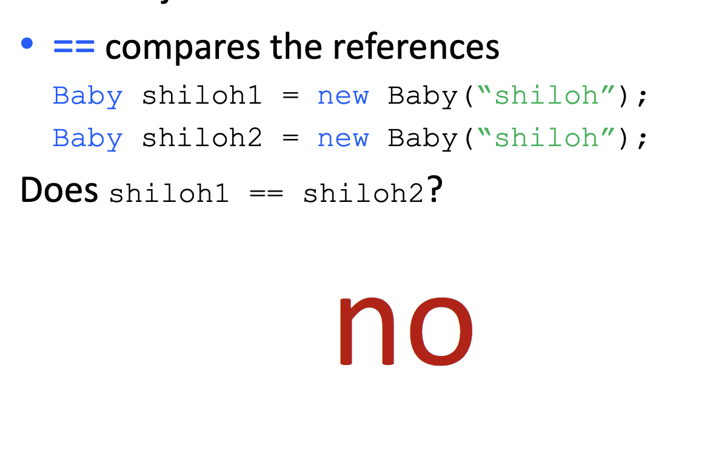
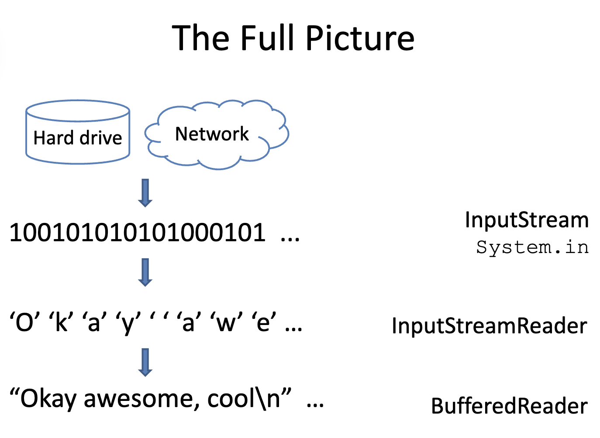
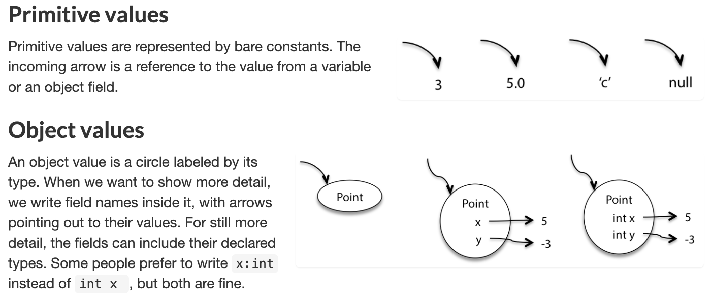
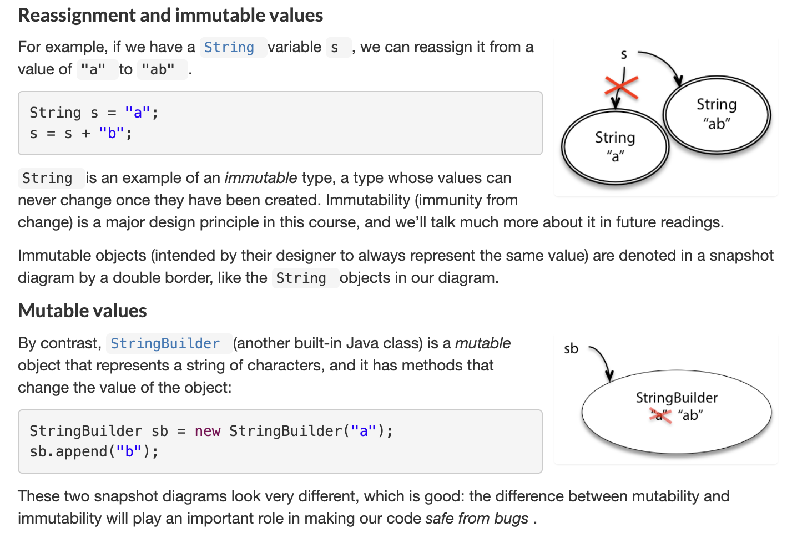
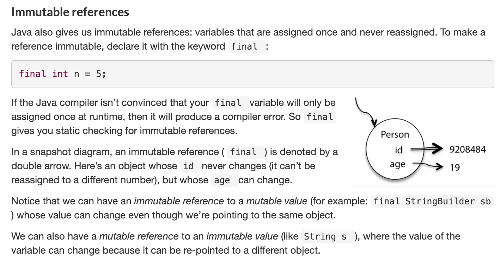

# Basic Java

## Getting started  with the Java Tutorials

### Basics



Program Structure

```java
class CLASSNAME {
	public static void main(String[] arguments) {
		STATEMENTS
	}
}
```

### Object oriented programming

```java
public class Baby {
	String name;
	double weight = 5.0;
	boolean isMale;
	int numPoops = 0;
	Baby[] siblings;
}
```

#### Constructors

- Constructors' name is the same as the class name.

- No return type. Never return anything.

- Usually initialize fields.

- All classes need at least one constructor. 

  - If you don't write one, defaults to 

    ```java
    CLASSNAME () {
    }
    ```

```java
public class Baby {
	String name;
	boolean isMale;
	Baby (String myname, boolean maleBaby) {
		name = myname;
		isMale = maleBaby;
	}
}
```

#### Methods

```java
public class Baby {
	String name = "Slim Shady";
	...
	void sayHi() {
		System.out.println("Hi, my name is " + name);
	}
}
```

#### Baby class

```java
public class Baby {
	String name; // “field": property
	double weight = 5.0;
	boolean isMale;
	int numPoops = 0;
	Baby[] siblings;
	
	void sayHi() {...}
	void eat(double foodWeight) {...}
}
```

### References vs Values

#### Primitive

Primitive types are basic java types

- int, long, double, boolean, char, short, byte, float
- The actual values are sorted in the variable

#### Reference

Reference types are arrays and objects

- String, int[], Baby, ...

#### How Java stores primitives

- Variables are like fixed size cups
- Primitives are small enough that they just fit into the cup

#### How Java stores objects

Objects are too big to fit in a variable. Thus, Variable stores a number that locates the object.

The object's location is called a **reference**. 

- `==` compares the references;



#### References

- Using `=` updates the reference.

- using [] or .
  - Follows the reference to the object
  - **May modify the object, but never the reference**

#### Static

- Applies to fields  (that is member variable) and methods
- Means the field/method
  - Is **defined for the class declaration **
  - Is **not** unique for each instance

##### Static field

Keep track of the number of babies that have been made.

```java
public class Baby {
	static int numBabiesMade = 0;
	Babny () {
		numBabiesMade += 1;
	}
}
```

##### Static method

```java
public class Baby {
	static void cry (Baby thebaby) {
		System.out.println(thebaby.name + "cries");
	}
}
```

non-static methods can reference static methods, but not the other way around.

```java
public class Baby {
	String name = "DXM";
	static void whoami() { // Illegal !!!
		System.out.println(name); 
	}
}
```

### Access Control

- **Public:** others can use this
- **Private:** only the class can use this
- public and private applies to any field or method

```java
public class CreditCard {
	private String cardNumber;
	private double expenses;
	public void charge(double amount) {
		expenses = expenses + amount;
	}
	public String getCardNumber(String password) {
		if (password.equals("SECRET!#*!")) {
			return cardNumber;
		}
		return "jerkface"
	}
}
```

Why access control

- Protect private information 
- Clarify how others should use your class
- Keep implementation separate from interface

#### Class scope

- Previous lessons: method-level scope

  ```java
  void method(int arg1) {
  	int arg2 = arg1 + 1;
  }
  ```

- This lesson: **class-level scope**

  ```java
  class Example {
  	int memberVariable; // class-level
  	void setVariable(int newVal) {
  		memberVariable += newVal;
  	}
  }
  ```

##### Only method-level 'servings' is updated

This is called **shadowing**, which means local variables hide member variables. This is why we may need `this` keyword.

```java
public class Baby {
	int servings;
	void feed(int servings) {
		servings = servings + servings; // only method-level 'servings' is updated
	}
	void poop() {
		System.out.println("All better!");
		servings = 0;
	}
}
```

##### `this` keyword

- Clarify scope
- Means 'my object'

```java
public class Baby {
	int servings;
	void feed(int servings) {
		this.servings = this.servings + servings; // Object-level 'servings' is updated
	}
	void poop() {
		System.out.println("All better!");
		servings = 0;
	}
}
```

### Packages

- Each class belongs to a package
- Classes in the same package serve a similar purpose 
- Packages are just directories
- Classes in other packages need to be imported

```java
package parenttools;

public class BabyFood {

}
```

```java
package parenttools;

public class Baby {

}
```

```java
package adult;

import parenttools.Baby;
import parenttools.BabyFood;

public class Parent {
	public static void main(String[] args) {
		Baby baby = new Baby()；
		baby.feed(new BabyFood());
	}
}
```

Why packages?

- Combine similar functionality
- Separate similar names
  - shopping.List
  - packing.List

##### Special Packages

- All classes "see" classes in the same package (no import needed)
- All classes "see" classes in `java.lang`
  - Example: `java.lang.String`; `java.lang.System`

### Java Interface

- Manipulate objects, without knowing how they work
- Useful when you have similar but not identical objects
- Useful when you want to use code written by others

#### Interface

- Set of classes that share methods
- Declare an interface with the common methods
- Can use the interface, without knowing an object's specific type

```java
import java.awt.Graphics;

interface Drawable {
	void draw(Graphics surface);
	void setColor(Color color);
}
```

```java
import java.awt.Graphics;

class Flower implements Drawable {
	// ... other stuff ...
	public void draw(Graphics surface) {
		// ... code to draw a flower here ...
	}
}
```

#### Interface Notes

- Only have methods (mostly true)
- Do not provide code, only definition (called  *signatures*)
- A class can implement any number of interface

#### Using interfaces

Can only access stuff in the interface.

```java
Drawable d = new BouncingBox(...);
d.setMovementVector(1, 1);
```

#### Casting

If you know that a variable holds a specific type, you can use a cast:

```java
Drawable d = new BouncingBox(...);
BouncingBox box = (BouncingBox) d;
box.setMovementVector(1, 1);
```

#### Summary

- It's a contract!
- You must implement **ALL** the methods
- All fields are **final** (cannot be changed)

### Inheritance

- ```class A extends B {}```: A is a subclass of B
- A has all the fields and methods that B has
- A can add it's own fields and methods
- A can only have 1 parent
- A can replace a parent's method by re-implementing  it
- If A does not implement something, Java searches ancestors

### Exceptions

Events that occurs when something "unexpected" happens

#### Why use an Exception?

- To tell the code using your method that something went wrong
- Debugging and understanding control flow

#### How do exceptions "happen" ?

- Java does not know what to do, so it
  - Creates an Exception object
  - Includes some useful information
  - "Throws" the Exception
- You can create and throw Exceptions too!

#### public class Exception

- Exception is a class

- Just inherit from it

  ```java
  public class MyException extends Exception {
  
  }
  ```

#### Warn Java about the Exception

```java
public Object get(int index) throws ArrayOutOfBoundsException {
	if (index < 0 || index >= size())
		throw new ArrayOutOfBoundsException("" + index);
}
```

- `throws` tells Java `get` may throw the ArrayOutOfBoundsException
- `throw` actually throws the Exception

#### Catching an Exception

Java now expects code that calls `get` to deal with the exception by 

- Catching it

```java
try {
	get(-1);
} catch (ArrayOutOfBoundsException err) {
	System.out.println("Oh dear!");
}
```

- Rethrowing it
  - Maybe you don not want to deal with the Exception
  - Tell Java that your method throws it too

```java
void doBad() throws ArrayOutOfBoundsException {
	get(-1);
}
```

### I/O



## Snapshot diagrams

Snapshot diagrams represent the internal state of a program at runtime - its stack (methods in progress and their local variables) and its heap (object that currently exist).



#### Mutating values vs. resassinging variables 





Java 8 API document: https://docs.oracle.com/javase/8/docs/api/