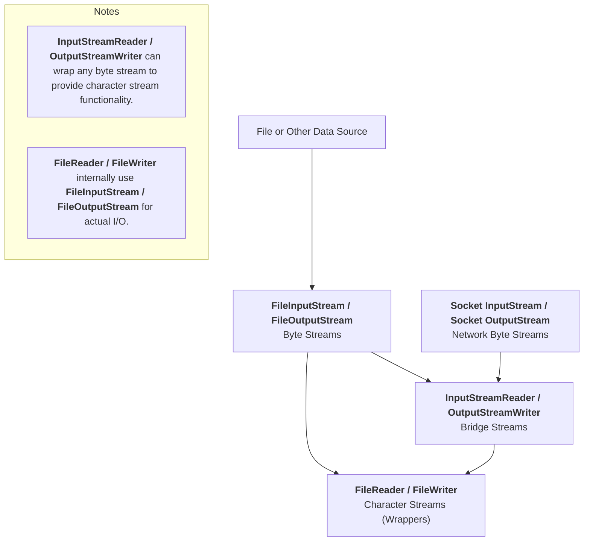
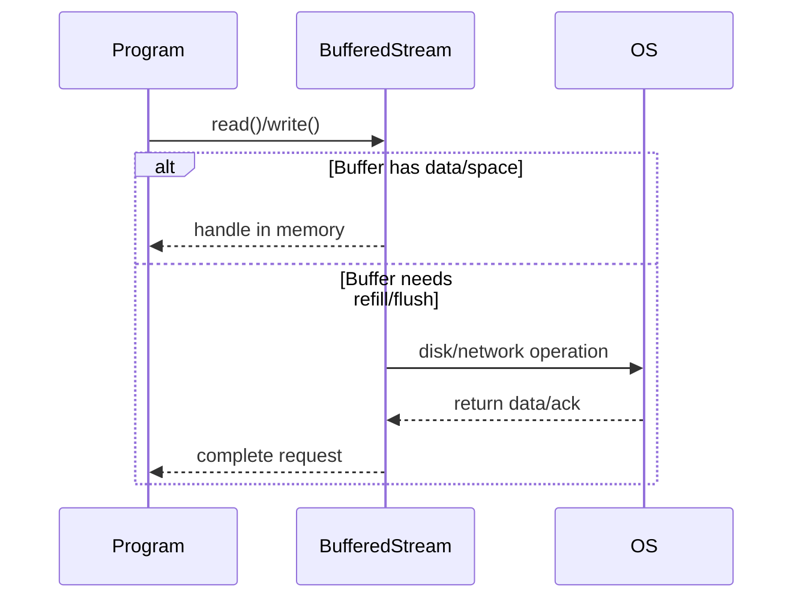

# Reading 21-Sockets & Networking

## Client/server design pattern

In this pattern there are two kinds of processes: clients and servers.

A client initiates the communication by connecting to a server. The client sends requests to the server, and the server sends replies back. Finally, the client disconnects. A server might handle connections from many clients concurrently, and clients might also connect to multiple servers.

On the Internet, client and server processes are often running on different machines, connected only by the network, but it doesn’t have to be that way — t**he server can be a process running on the same machine as the client.**

## Network sockets

### IP addresses

A network interface is identified by an IP address. Pv4 addresses are 32-bit numbers written in four 8-bit parts. For example (as of this writing):

- `127.0.0.1 `is the [loopback ](https://en.wikipedia.org/wiki/Loopback)or [localhost ](https://en.wikipedia.org/wiki/Localhost)address: it always refers to the local machine. Technically, any address whose first octet is `127 `is a loopback address, but `127.0.0.1 `is standard.

You can [ask Google for your current IP address ](https://www.google.com/search?q=my+ip). In general, as you carry around your laptop, every time you connect your machine to the network it can be assigned a new IP address.

### Hostnames

Hostnames are names that can be translated into IP addresses. A single hostname can map to different IP addresses; and multiple hostnames can map to the same IP address. For example:

- `web.mit.edu `is the name for MIT’s web server. You can translate this name to an IP address yourself using `dig `, `host `, or `nslookup `on the command line, e.g.:

  ```shell
  $ dig +short web.mit.edu
  18.9.22.69
  ```

- `localhost `is a name for `127.0.0.1 `. When you want to talk to a server running on your own machine, talk to `localhost `.

Translation from hostnames to IP addresses is the job of the [Domain Name System (DNS) ](https://en.wikipedia.org/wiki/Domain_Name_System). It’s super cool, but not part of our discussion today.

### Port numbers

A single machine might have mutiple server applications that clients wish to connect to, so we need a way to direct traffic on the same network interface to different processes.

Network interfaces have multiple [ports ](https://en.wikipedia.org/wiki/Port_(computer_networking))identified by a 16-bit number from 0 (which is reserved, so we effectively start at 1) to 65535.

A server process binds to a particular port — it is now **listening** on that port. Clients have to know which port number the server is listening on. There are some [well-known ports ](https://en.wikipedia.org/wiki/List_of_TCP_and_UDP_port_numbers#Well-known_ports)which are reserved for system-level processes and provide standard ports for certain services. For example:

- Port 22 is the standard SSH port. When you connect to `athena.dialup.mit.edu `using SSH, the software automatically uses port 22.
- Port 25 is the standard email server port.
- Port 80 is the standard web server port. When you connect to the URL `http://web.mit.edu `in your web browser, it connects to `18.9.22.69 `on port 80.

When the port is not a standard port, it is specified as part of the address. For example, the URL `http://128.2.39.10:9000 `refers to port 9000 on the machine at `128.2.39.10 `.

When a client connects to a server, that outgoing connection also uses a port number on the client’s network interface, usually chosen at random from the available *non* -well-known ports.

### Network sockets

A [**socket** ](https://en.wikipedia.org/wiki/Network_socket)represents one end of the connection between client and server.

- A **listening socket** is used by a server process to wait for connections from remote clients.

  In Java, use [`ServerSocket `](https://docs.oracle.com/javase/8/docs/api/?java/net/ServerSocket.html)to make a listening socket, and use its [`accept `](https://docs.oracle.com/javase/8/docs/api/java/net/ServerSocket.html#accept--)method to listen to it.

- A **connected socket** can send and receive messages to and from the process on the other end of the connection. It is identified by both the local IP address and port number plus the remote address and port, which allows a server to differentiate between concurrent connections from different IPs, or from the same IP on different remote ports.

  In Java, clients use a [`Socket `](https://docs.oracle.com/javase/8/docs/api/?java/net/Socket.html)constructor to establish a socket connection to a server. Servers obtain a connected socket as a `Socket `object returned from `ServerSocket.accept `

## I/O

### Buffers

The data that clients and servers exchange over the network is sent in chunks. These are rarely just byte-sized chunks, although they might be. The sending side (the client sending a request or the server sending a response) typically writes a large chunk (maybe a whole string like “HELLO, WORLD!” or maybe 20 megabytes of video data). The network chops that chunk up into packets, and each packet is routed separately over the network. At the other end, the receiver reassembles the packets together into a stream of bytes.

The result is a bursty kind of data transmission — the data may already be there when you want to read them, or you may have to wait for them to arrive and be reassembled.

When data arrive, they go into a **buffer** , an array in memory that holds the data until you read it.

### Streams

The data going into or coming out of a socket is a stream of bytes.

In Java, `InputStream` objects represent sources of data flowing into your program.

- Reading from a file on disk with a `FileInputStream`
- User input from `System.in`
- Input from a network socket

`OutputStream` objects represent data sinks, places we can write data to. 

- `FileOutputStream` for saving to files
- `System.out` is a `PrintStream`, an `OutputStream` that prints readable representations of various types
- Output to a network socket

With sockets, remember that the *output* of one process is the *input* of another process. If Alice and Bob have a socket connection, Alice has an output stream that flows to Bob’s input stream, and *vice versa* .

> A stream can be thought of as **items on a conveyor belt** being processed one at a time rather than in large batches.
>
> **Normal functions cannot operate on streams as a whole** because they have potentially unlimited data.
>
> https://docs.oracle.com/javase/tutorial/essential/io/streams.html

#### I/O Streams

An I/O Stream represents an input source or output destination, such as disk files, devices, other programs, or memory arrays.

Streams can handle **various data types**: bytes, primitive data types, localized characters, and objects.

Regardless of internal working, **all streams present a simple model**: a stream is a sequence of data items.

#### Byte Streams

Programs use **byte streams** to perform input and output of 8-bit bytes. All byte stream classes are descended from `InputStream` and `OutputStream`.

There are many byte stream classes. To demonstrate how byte streams work, we'll focus on the file I/O byte streams, [`FileInputStream`](https://docs.oracle.com/javase/8/docs/api/java/io/FileInputStream.html) and [`FileOutputStream`](https://docs.oracle.com/javase/8/docs/api/java/io/FileOutputStream.html). 

##### Using Byte Streams

We'll explore `FileInputStream` and `FileOutputStream` by examining an example program named [`CopyBytes`](https://docs.oracle.com/javase/tutorial/essential/io/examples/CopyBytes.java), which uses byte streams to copy `xanadu.txt`, one byte at a time.

```Java
import java.io.FileInputStream;
import java.io.FileOutputStream;
import java.io.IOException;

public class CopyBytes {
    public static void main(String[] args) throws IOException {

        FileInputStream in = null;
        FileOutputStream out = null;

        try { 
          	// codes that may throw an exception
            in = new FileInputStream("xanadu.txt");
            out = new FileOutputStream("outagain.txt");
            int c;

            while ((c = in.read()) != -1) {
                out.write(c);
            }
        } finally { 
          	// codes that will always excute
            if (in != null) {
              // Only close if the stream was successfully opened!
              // This avoids NullPointerException if the stream was never opened.
                in.close();
            }
            if (out != null) {
                out.close();
            }
        }
    }
}
```

`CopyBytes` spends most of its time in a simple loop that reads the input stream and writes the output stream, one byte at a time, as shown in the following figure.


##### Always Close Streams

Closing a stream when it's no longer needed is very important — s**o important that `CopyBytes` uses a `finally` block to guarantee that both streams will be closed even if an error occurs**. This practice helps avoid serious resource leaks.

##### When Not to Use Byte Streams

`CopyBytes` seems like a normal program, but it actually represents a kind of low-level I/O that you should avoid.

Use byte streams only for low-level, binary I/O. For text and characters, always prefer character streams. Byte streams are important because they're the foundation for all other stream types in Java.

#### Character Streams

The Java platform stores character values using Unicode conventions. Character stream I/O **automatically translates** this internal format to and from the local character set.

Byn using character streams for text I/O, your program will be easy to adapt for **internationalization** in the future, even if you don not consider it at first.

##### Using Character Streams

All character stream classes are descended from [`Reader`](https://docs.oracle.com/javase/8/docs/api/java/io/Reader.html) and [`Writer`](https://docs.oracle.com/javase/8/docs/api/java/io/Writer.html). As with byte streams, there are character stream classes that specialize in file I/O: [`FileReader`](https://docs.oracle.com/javase/8/docs/api/java/io/FileReader.html) and [`FileWriter`](https://docs.oracle.com/javase/8/docs/api/java/io/FileWriter.html). The [`CopyCharacters`](https://docs.oracle.com/javase/tutorial/essential/io/examples/CopyCharacters.java) example illustrates these classes.

```Java
import java.io.FileReader;
import java.io.FileWriter;
import java.io.IOException;

public class CopyCharacters {
    public static void main(String[] args) throws IOException {

        FileReader inputStream = null;
        FileWriter outputStream = null;

        try {
            inputStream = new FileReader("xanadu.txt");
            outputStream = new FileWriter("characteroutput.txt");

            int c;
            while ((c = inputStream.read()) != -1) {
                outputStream.write(c);
            }
        } finally {
            if (inputStream != null) {
                inputStream.close();
            }
            if (outputStream != null) {
                outputStream.close();
            }
        }
    }
}
```

`CopyCharacters` is very similar to `CopyBytes`. The most important difference is that `CopyCharacters` uses `FileReader` and `FileWriter` for input and output in place of `FileInputStream` and `FileOutputStream`. Notice that both `CopyBytes` and `CopyCharacters` use an **`int` variable** to read to and write from. However, in `CopyCharacters`, the `int` variable holds a character value in its last 16 bits (Unicode) ; in `CopyBytes`, the `int` variable holds a `byte` value in its last 8 bits.

- **Character Stream = Byte Stream + Encoding/Decoding Functionality**
   Character streams wrap byte streams and automatically handle the conversion between bytes and characters (encoding and decoding). Example: `FileReader`, `FileWriter`.
- **Bridge Stream = Universal Adapter that Converts Any Byte Stream to a Character Stream**
   Bridge streams, like `InputStreamReader` and `OutputStreamWriter`, can wrap any byte stream (e.g., from files or sockets) and provide character stream capabilities, allowing you to specify character encoding as needed.




#### Line-Oriented I/O

Character I/O usually occurs in bigger units than single characters. One common unit is the line: a string of characters with a line terminator at the end.

```java
import java.io.FileReader;
import java.io.FileWriter;
import java.io.BufferedReader;
import java.io.PrintWriter;
import java.io.IOException;

public class CopyLines {
    public static void main(String[] args) throws IOException {

        BufferedReader inputStream = null;
        PrintWriter outputStream = null;

        try {
            inputStream = new BufferedReader(new FileReader("xanadu.txt"));
            outputStream = new PrintWriter(new FileWriter("characteroutput.txt"));

            String l;
            while ((l = inputStream.readLine()) != null) {
                outputStream.println(l);
            }
        } finally {
            if (inputStream != null) {
                inputStream.close();
            }
            if (outputStream != null) {
                outputStream.close();
            }
        }
    }
}
```

Invoking `readLine` returns a line of text with the line. `CopyLines` outputs each line using `println`, which appends the line terminator for the current operating system. This might not be the same line terminator that was used in the input file. 

#### Buffered Streams

Most of the examples we have seen so far use **unbuffered I/O**, which means each read or write request is handled directly by the underlying OS. This can make a program much less efficient, since each such request often triggers disk access, network activity, or some other operation that is relatively expensive.

To reduce this kind of overhead, the Java platform implements *buffered* I/O streams. Buffered input streams read data from a memory area known as a *buffer*; the native input API is called only when the buffer is empty. 

> Using a buffer significantly improves I/O efficiency by **reducing the number of costly direct operations to the underlying hardware.**



A program can convert an unbuffered stream into a buffered stream using the wrapping idiom we've used several times now, where the unbuffered stream object is passed to the constructor for a buffered stream class. Here's how you might modify the constructor invocations in the `CopyCharacters` example to use buffered I/O:

```java
inputStream = new BufferedReader(new FileReader("xanadu.txt"));
outputStream = new BufferedWriter(new FileWriter("characteroutput.txt"));
```

It often makes sense to write out a buffer at critical points, without waiting for it to fill. This is known as *flushing* the buffer. To flush a stream manually, invoke its `flush` method. The `flush` method is valid on any output stream, but has no effect unless the stream is buffered.

> Whenever you need to make sure that important data is immediately written out, especially in logging, networking, or interactive applications, you should flush the buffered stream rather than waiting for the buffer to fill up automatically.

#### Scanning and Formatting

> Scanning is about breaking input into useful data pieces, while formatting is about creating human-friendly output from program data.

##### Breaking Input into Tokens

By default, a scanner uses white space to separate tokens. (White space characters include blanks, tabs, and line terminators. To see how scanning works, let's look at [`ScanXan`](https://docs.oracle.com/javase/tutorial/essential/io/examples/ScanXan.java), a program that reads the individual words in `xanadu.txt` and prints them out, one per line.

```java
import java.io.*;
import java.util.Scanner;

public class ScanXan {
    public static void main(String[] args) throws IOException {

        Scanner s = null;

        try {
            s = new Scanner(new BufferedReader(new FileReader("xanadu.txt")));

            while (s.hasNext()) {
                System.out.println(s.next());
            }
        } finally {
            if (s != null) {
                s.close();
            }
        }
    }
}
```

Notice that `ScanXan` invokes `Scanner`'s `close` method when it is done with the scanner object. Even though a scanner is not a stream, you need to close it to indicate that you're done with its underlying stream.

The output of `ScanXan` looks like this:

```
In
Xanadu
did
Kubla
Khan
A
stately
pleasure-dome
...
```

To use a different token separator, invoke `useDelimiter()`, specifying a regular expression. For example, suppose you wanted the token separator to be a comma, optionally followed by white space. You would invoke,

```java
s.useDelimiter(",\\s*");
```

##### Formatting

**Formatting** is the process of converting data into a well-structured and human-readable text form according to specific patterns or rules.

```Java
System.out.format("The square root of %d is %f.%n", i, r)
```

#### I/O from the Command Line

The Java platform supports this kind of interaction in two ways: through the **Standard Streams** and through the **Console**.

##### Standard Streams

Standard Streams are a feature of many operating systems. By default, they read input from the keyboard and write output to the display. They also support I/O on files and between programs, but that feature is controlled by the command line interpreter, not the program.


- Standard Input: `System.in`
- Standard Output: `System.out`
- Standard Error: `System.err`

##### The Console


## Blocking

**Blocking** means that a thread waits (without doing further work) until an event occurs. We can use this term to describe methods and method calls: 

- If a method is a **blocking method**, then a call to that method can **block**, waiting until some event occurs before it returns to the caller.

Socket input/output streams exhibit blocking behavior:

- When an incoming socket's buffer is empty, calling `read` blocks until data are available.
- When the destination socket's buffer is full, calling `write` blocks until space is avaiable.

> Blocking is very convenient from a programmer's point of view, because the programmer can write code as if the `read `(or `write `) call will always work, no matter what the timing of data arrival. 

Blocking happens throughout concurrent programming, not just in [I/O ](https://en.wikipedia.org/wiki/Input/output)(communication into and out of a process, perhaps over a network, or to/from a file, or with the user on the command line or a GUI, …). Concurrent modules don’t work in lockstep, like sequential programs do, so they typically have to wait for each other to catch up when coordinated action is required.

We’ll see in the next reading that this waiting gives rise to the second major kind of bug (the first was race conditions) in concurrent programming: **deadlock** , where modules are waiting for each other to do something, so none of them can make any progress. But that’s for next time.

## Using network sockets

Make sure you’ve read about [streams ](https://ocw.mit.edu/ans7870/6/6.005/s16/classes/21-sockets-networking/#streams)at the Java Tutorial link above, then read about network sockets:

In the Java Tutorials, read:

- [All About Sockets ](https://docs.oracle.com/javase/tutorial/networking/sockets/index.html)(4 pages)

This reading describes everything you need to know about creating server- and client-side sockets and writing to and reading from their I/O streams.
