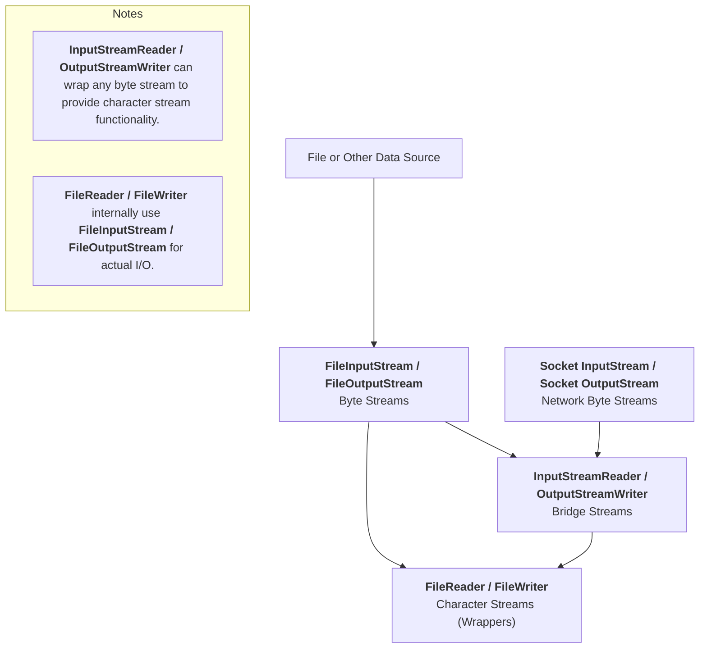
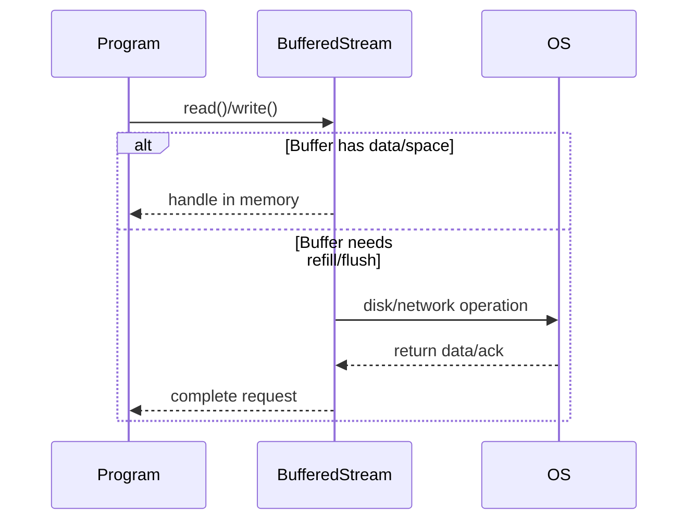
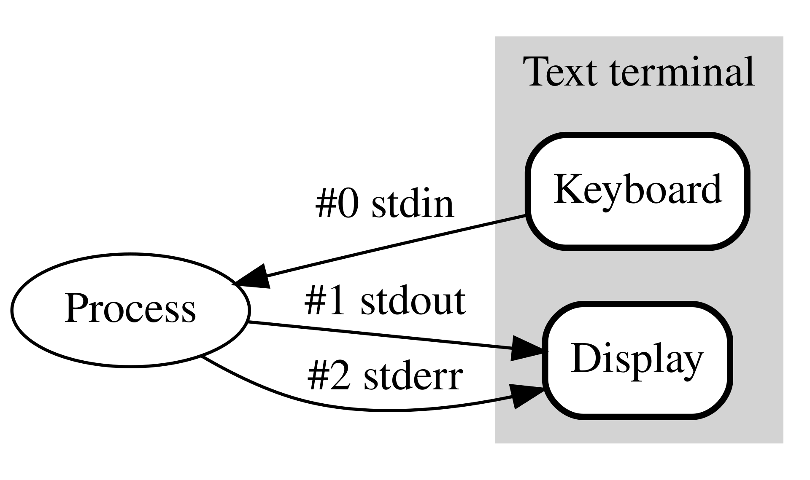

# Reading 21-Sockets & Networking

## Client/server design pattern

In this pattern there are two kinds of processes: clients and servers.

A client initiates the communication by connecting to a server. The client sends requests to the server, and the server sends replies back. Finally, the client disconnects. A server might handle connections from many clients concurrently, and clients might also connect to multiple servers.

On the Internet, client and server processes are often running on different machines, connected only by the network, but it doesn’t have to be that way — t**he server can be a process running on the same machine as the client.**

## Network sockets

### IP addresses

A network interface is identified by an IP address. Pv4 addresses are 32-bit numbers written in four 8-bit parts. For example (as of this writing):

- `127.0.0.1 `is the [loopback ](https://en.wikipedia.org/wiki/Loopback)or [localhost ](https://en.wikipedia.org/wiki/Localhost)address: it always refers to the local machine. Technically, any address whose first octet is `127 `is a loopback address, but `127.0.0.1 `is standard.

You can [ask Google for your current IP address ](https://www.google.com/search?q=my+ip). In general, as you carry around your laptop, every time you connect your machine to the network it can be assigned a new IP address.

### Hostnames

Hostnames are names that can be translated into IP addresses. A single hostname can map to different IP addresses; and multiple hostnames can map to the same IP address. For example:

- `web.mit.edu `is the name for MIT’s web server. You can translate this name to an IP address yourself using `dig `, `host `, or `nslookup `on the command line, e.g.:

  ```shell
  $ dig +short web.mit.edu
  18.9.22.69
  ```

- `localhost `is a name for `127.0.0.1 `. When you want to talk to a server running on your own machine, talk to `localhost `.

Translation from hostnames to IP addresses is the job of the [Domain Name System (DNS) ](https://en.wikipedia.org/wiki/Domain_Name_System). It’s super cool, but not part of our discussion today.

### Port numbers

A single machine might have mutiple server applications that clients wish to connect to, so we need a way to direct traffic on the same network interface to different processes.

Network interfaces have multiple [ports ](https://en.wikipedia.org/wiki/Port_(computer_networking))identified by a 16-bit number from 0 (which is reserved, so we effectively start at 1) to 65535.

A server process binds to a particular port — it is now **listening** on that port. Clients have to know which port number the server is listening on. There are some [well-known ports ](https://en.wikipedia.org/wiki/List_of_TCP_and_UDP_port_numbers#Well-known_ports)which are reserved for system-level processes and provide standard ports for certain services. For example:

- Port 22 is the standard SSH port. When you connect to `athena.dialup.mit.edu `using SSH, the software automatically uses port 22.
- Port 25 is the standard email server port.
- Port 80 is the standard web server port. When you connect to the URL `http://web.mit.edu `in your web browser, it connects to `18.9.22.69 `on port 80.

When the port is not a standard port, it is specified as part of the address. For example, the URL `http://128.2.39.10:9000 `refers to port 9000 on the machine at `128.2.39.10 `.

When a client connects to a server, that outgoing connection also uses a port number on the client’s network interface, usually chosen at random from the available *non* -well-known ports.

### Network sockets

A [**socket** ](https://en.wikipedia.org/wiki/Network_socket)represents one end of the connection between client and server.

- A **listening socket** is used by a server process to wait for connections from remote clients.

  In Java, use [`ServerSocket `](https://docs.oracle.com/javase/8/docs/api/?java/net/ServerSocket.html)to make a listening socket, and use its [`accept `](https://docs.oracle.com/javase/8/docs/api/java/net/ServerSocket.html#accept--)method to listen to it.

- A **connected socket** can send and receive messages to and from the process on the other end of the connection. It is identified by both the local IP address and port number plus the remote address and port, which allows a server to differentiate between concurrent connections from different IPs, or from the same IP on different remote ports.

  In Java, clients use a [`Socket `](https://docs.oracle.com/javase/8/docs/api/?java/net/Socket.html)constructor to establish a socket connection to a server. Servers obtain a connected socket as a `Socket `object returned from `ServerSocket.accept `

## I/O

### Buffers

The data that clients and servers exchange over the network is sent in chunks. These are rarely just byte-sized chunks, although they might be. The sending side (the client sending a request or the server sending a response) typically writes a large chunk (maybe a whole string like “HELLO, WORLD!” or maybe 20 megabytes of video data). The network chops that chunk up into packets, and each packet is routed separately over the network. At the other end, the receiver reassembles the packets together into a stream of bytes.

The result is a bursty kind of data transmission — the data may already be there when you want to read them, or you may have to wait for them to arrive and be reassembled.

When data arrive, they go into a **buffer** , an array in memory that holds the data until you read it.

### Streams

The data going into or coming out of a socket is a stream of bytes.

In Java, `InputStream` objects represent sources of data flowing into your program.

- Reading from a file on disk with a `FileInputStream`
- User input from `System.in`
- Input from a network socket

`OutputStream` objects represent data sinks, places we can write data to. 

- `FileOutputStream` for saving to files
- `System.out` is a `PrintStream`, an `OutputStream` that prints readable representations of various types
- Output to a network socket

With sockets, remember that the *output* of one process is the *input* of another process. If Alice and Bob have a socket connection, Alice has an output stream that flows to Bob’s input stream, and *vice versa* .

> A stream can be thought of as **items on a conveyor belt** being processed one at a time rather than in large batches.
>
> **Normal functions cannot operate on streams as a whole** because they have potentially unlimited data.
>
> https://docs.oracle.com/javase/tutorial/essential/io/streams.html

#### I/O Streams

An I/O Stream represents an input source or output destination, such as disk files, devices, other programs, or memory arrays.

Streams can handle **various data types**: bytes, primitive data types, localized characters, and objects.

Regardless of internal working, **all streams present a simple model**: a stream is a sequence of data items.

#### Byte Streams

Programs use **byte streams** to perform input and output of 8-bit bytes. All byte stream classes are descended from `InputStream` and `OutputStream`.

There are many byte stream classes. To demonstrate how byte streams work, we'll focus on the file I/O byte streams, [`FileInputStream`](https://docs.oracle.com/javase/8/docs/api/java/io/FileInputStream.html) and [`FileOutputStream`](https://docs.oracle.com/javase/8/docs/api/java/io/FileOutputStream.html). 

##### Using Byte Streams

We'll explore `FileInputStream` and `FileOutputStream` by examining an example program named [`CopyBytes`](https://docs.oracle.com/javase/tutorial/essential/io/examples/CopyBytes.java), which uses byte streams to copy `xanadu.txt`, one byte at a time.

```Java
import java.io.FileInputStream;
import java.io.FileOutputStream;
import java.io.IOException;

public class CopyBytes {
    public static void main(String[] args) throws IOException {

        FileInputStream in = null;
        FileOutputStream out = null;

        try { 
          	// codes that may throw an exception
            in = new FileInputStream("xanadu.txt");
            out = new FileOutputStream("outagain.txt");
            int c;

            while ((c = in.read()) != -1) {
                out.write(c);
            }
        } finally { 
          	// codes that will always excute
            if (in != null) {
              // Only close if the stream was successfully opened!
              // This avoids NullPointerException if the stream was never opened.
                in.close();
            }
            if (out != null) {
                out.close();
            }
        }
    }
}
```

`CopyBytes` spends most of its time in a simple loop that reads the input stream and writes the output stream, one byte at a time, as shown in the following figure.


##### Always Close Streams

Closing a stream when it's no longer needed is very important — s**o important that `CopyBytes` uses a `finally` block to guarantee that both streams will be closed even if an error occurs**. This practice helps avoid serious resource leaks.

##### When Not to Use Byte Streams

`CopyBytes` seems like a normal program, but it actually represents a kind of low-level I/O that you should avoid.

Use byte streams only for low-level, binary I/O. For text and characters, always prefer character streams. Byte streams are important because they're the foundation for all other stream types in Java.

#### Character Streams

The Java platform stores character values using Unicode conventions. Character stream I/O **automatically translates** this internal format to and from the local character set.

Byn using character streams for text I/O, your program will be easy to adapt for **internationalization** in the future, even if you don not consider it at first.

##### Using Character Streams

All character stream classes are descended from [`Reader`](https://docs.oracle.com/javase/8/docs/api/java/io/Reader.html) and [`Writer`](https://docs.oracle.com/javase/8/docs/api/java/io/Writer.html). As with byte streams, there are character stream classes that specialize in file I/O: [`FileReader`](https://docs.oracle.com/javase/8/docs/api/java/io/FileReader.html) and [`FileWriter`](https://docs.oracle.com/javase/8/docs/api/java/io/FileWriter.html). The [`CopyCharacters`](https://docs.oracle.com/javase/tutorial/essential/io/examples/CopyCharacters.java) example illustrates these classes.

```Java
import java.io.FileReader;
import java.io.FileWriter;
import java.io.IOException;

public class CopyCharacters {
    public static void main(String[] args) throws IOException {

        FileReader inputStream = null;
        FileWriter outputStream = null;

        try {
            inputStream = new FileReader("xanadu.txt");
            outputStream = new FileWriter("characteroutput.txt");

            int c;
            while ((c = inputStream.read()) != -1) {
                outputStream.write(c);
            }
        } finally {
            if (inputStream != null) {
                inputStream.close();
            }
            if (outputStream != null) {
                outputStream.close();
            }
        }
    }
}
```

`CopyCharacters` is very similar to `CopyBytes`. The most important difference is that `CopyCharacters` uses `FileReader` and `FileWriter` for input and output in place of `FileInputStream` and `FileOutputStream`. Notice that both `CopyBytes` and `CopyCharacters` use an **`int` variable** to read to and write from. However, in `CopyCharacters`, the `int` variable holds a character value in its last 16 bits (Unicode) ; in `CopyBytes`, the `int` variable holds a `byte` value in its last 8 bits.

- **Character Stream = Byte Stream + Encoding/Decoding Functionality**
   Character streams wrap byte streams and automatically handle the conversion between bytes and characters (encoding and decoding). Example: `FileReader`, `FileWriter`.
- **Bridge Stream = Universal Adapter that Converts Any Byte Stream to a Character Stream**
   Bridge streams, like `InputStreamReader` and `OutputStreamWriter`, can wrap any byte stream (e.g., from files or sockets) and provide character stream capabilities, allowing you to specify character encoding as needed.




#### Line-Oriented I/O

Character I/O usually occurs in bigger units than single characters. One common unit is the line: a string of characters with a line terminator at the end.

```java
import java.io.FileReader;
import java.io.FileWriter;
import java.io.BufferedReader;
import java.io.PrintWriter;
import java.io.IOException;

public class CopyLines {
    public static void main(String[] args) throws IOException {

        BufferedReader inputStream = null;
        PrintWriter outputStream = null;

        try {
            inputStream = new BufferedReader(new FileReader("xanadu.txt"));
            outputStream = new PrintWriter(new FileWriter("characteroutput.txt"));

            String l;
            while ((l = inputStream.readLine()) != null) {
                outputStream.println(l);
            }
        } finally {
            if (inputStream != null) {
                inputStream.close();
            }
            if (outputStream != null) {
                outputStream.close();
            }
        }
    }
}
```

Invoking `readLine` returns a line of text with the line. `CopyLines` outputs each line using `println`, which appends the line terminator for the current operating system. This might not be the same line terminator that was used in the input file. 

#### Buffered Streams

Most of the examples we have seen so far use **unbuffered I/O**, which means each read or write request is handled directly by the underlying OS. This can make a program much less efficient, since each such request often triggers disk access, network activity, or some other operation that is relatively expensive.

To reduce this kind of overhead, the Java platform implements *buffered* I/O streams. Buffered input streams read data from a memory area known as a *buffer*; the native input API is called only when the buffer is empty. 

> Using a buffer significantly improves I/O efficiency by **reducing the number of costly direct operations to the underlying hardware.**



A program can convert an unbuffered stream into a buffered stream using the wrapping idiom we've used several times now, where the unbuffered stream object is passed to the constructor for a buffered stream class. Here's how you might modify the constructor invocations in the `CopyCharacters` example to use buffered I/O:

```java
inputStream = new BufferedReader(new FileReader("xanadu.txt"));
outputStream = new BufferedWriter(new FileWriter("characteroutput.txt"));
```

It often makes sense to write out a buffer at critical points, without waiting for it to fill. This is known as *flushing* the buffer. To flush a stream manually, invoke its `flush` method. The `flush` method is valid on any output stream, but has no effect unless the stream is buffered.

> Whenever you need to make sure that important data is immediately written out, especially in logging, networking, or interactive applications, you should flush the buffered stream rather than waiting for the buffer to fill up automatically.

#### Scanning and Formatting

> Scanning is about breaking input into useful data pieces, while formatting is about creating human-friendly output from program data.

##### Breaking Input into Tokens

By default, a scanner uses white space to separate tokens. (White space characters include blanks, tabs, and line terminators. To see how scanning works, let's look at [`ScanXan`](https://docs.oracle.com/javase/tutorial/essential/io/examples/ScanXan.java), a program that reads the individual words in `xanadu.txt` and prints them out, one per line.

```java
import java.io.*;
import java.util.Scanner;

public class ScanXan {
    public static void main(String[] args) throws IOException {

        Scanner s = null;

        try {
            s = new Scanner(new BufferedReader(new FileReader("xanadu.txt")));

            while (s.hasNext()) {
                System.out.println(s.next());
            }
        } finally {
            if (s != null) {
                s.close();
            }
        }
    }
}
```

Notice that `ScanXan` invokes `Scanner`'s `close` method when it is done with the scanner object. Even though a scanner is not a stream, you need to close it to indicate that you're done with its underlying stream.

The output of `ScanXan` looks like this:

```
In
Xanadu
did
Kubla
Khan
A
stately
pleasure-dome
...
```

To use a different token separator, invoke `useDelimiter()`, specifying a regular expression. For example, suppose you wanted the token separator to be a comma, optionally followed by white space. You would invoke,

```java
s.useDelimiter(",\\s*");
```

##### Formatting

**Formatting** is the process of converting data into a well-structured and human-readable text form according to specific patterns or rules.

```Java
System.out.format("The square root of %d is %f.%n", i, r)
```

#### I/O from the Command Line

The Java platform supports this kind of interaction in two ways: through the **Standard Streams** and through the **Console**.

##### Standard Streams

Standard Streams are a feature of many operating systems. By default, they read input from the keyboard and write output to the display. They also support I/O on files and between programs, but that feature is controlled by the command line interpreter, not the program.



- Standard Input: `System.in`
- Standard Output: `System.out`
- Standard Error: `System.err`

##### The Console

A more advanced alternative to the Standard Streams is the Console. This is a single, predefined object of type [`Console`](https://docs.oracle.com/javase/8/docs/api/java/io/Console.html) that has most of the features provided by the Standard Streams, and others besides. The Console is particularly useful for secure password entry. 

```java
import java.io.Console;

public class ConsoleDemo {
    public static void main(String[] args) {
        Console console = System.console();
        if (console == null) {
            System.out.println("No console available. Please run this from a command line.");
            return;
        }

        String name = console.readLine("Enter your name: ");
        char[] password = console.readPassword("Enter your password: ");
    
        console.printf("Welcome, %s!\n", name);
        console.printf("Your password length is %d\n", password.length);
    }
}
```
#### Data Streams

Data streams support binary I/O of primitive data type values (`boolean`, `char`, `byte`, `short`, `int`, `long`, `float`, and `double`) as well as String values.

Then `DataStreams` opens an output stream. Since a `DataOutputStream` can only be created as a wrapper for an existing byte stream object, `DataStreams` provides a buffered file output byte stream.

```java
out = new DataOutputStream(new BufferedOutputStream(
              new FileOutputStream(dataFile)));
out.writeInt(100);
out.writeDouble(3.14);
out.writeUTF("hello");
out.close();

DataInputStream in = new DataInputStream(new FileInputStream("data.bin"));
int num = in.readInt();
double pi = in.readDouble();
String str = in.readUTF();
in.close();
```

Use DataStreams when you need efficient, precise, and structured binary I/O for primitive types or strings—especially for **custom binary file formats, network protocols, or cross-language data exchange.**

For text data, object serialization, or high-level data handling, use the more appropriate Java APIs.

#### Object Streams

Just as data streams support I/O of primitive data types, object streams support I/O of objects. Most, but not all, standard classes support serialization of their objects. Those that do implement the marker interface [`Serializable`](https://docs.oracle.com/javase/8/docs/api/java/io/Serializable.html).

**Serialization (writing an object):**

```java
ObjectOutputStream out = new ObjectOutputStream(new FileOutputStream("data.bin"));
out.writeObject(myObject);
out.close();
```

**Deserialization (reading an object):**

```java
ObjectInputStream in = new ObjectInputStream(new FileInputStream("data.bin"));
MyClass obj = (MyClass) in.readObject();
in.close();
```

## Blocking

**Blocking** means that a thread waits (without doing further work) until an event occurs. We can use this term to describe methods and method calls: 

- If a method is a **blocking method**, then a call to that method can **block**, waiting until some event occurs before it returns to the caller.

Socket input/output streams exhibit blocking behavior:

- When an incoming socket's buffer is empty, calling `read` blocks until data are available.
- When the destination socket's buffer is full, calling `write` blocks until space is avaiable.

> Blocking is very convenient from a programmer's point of view, because the programmer can write code as if the `read `(or `write `) call will always work, no matter what the timing of data arrival. 

Blocking happens throughout concurrent programming, not just in [I/O ](https://en.wikipedia.org/wiki/Input/output)(communication into and out of a process, perhaps over a network, or to/from a file, or with the user on the command line or a GUI, …). Concurrent modules don’t work in lockstep, like sequential programs do, so they typically have to wait for each other to catch up when coordinated action is required.

We’ll see in the next reading that this waiting gives rise to the second major kind of bug (the first was race conditions) in concurrent programming: **deadlock** , where modules are waiting for each other to do something, so none of them can make any progress. But that’s for next time.

## Using network sockets

Make sure you’ve read about [streams ](https://ocw.mit.edu/ans7870/6/6.005/s16/classes/21-sockets-networking/#streams)at the Java Tutorial link above, then read about network sockets:

In the Java Tutorials, read:

- [All About Sockets ](https://docs.oracle.com/javase/tutorial/networking/sockets/index.html)(4 pages)

This reading describes everything you need to know about creating server- and client-side sockets and writing to and reading from their I/O streams.

In client-server applications, the server provides some service, such as processing database queries or sending out current stock prices. The client uses the service provided by the server, either displaying database query results to the user or making stock purchase recommendations to an investor. The communication that occurs between the client and the server must be reliable. That is, no data can be dropped and it must arrive on the client side in the same order in which the server sent it.

TCP provides a reliable, point-to-point communication channel that client-server applications on the Internet use to communicate with each other. To communicate over TCP, a client program and a server program establish a connection to one another. Each program binds **a socket** to its end of the connection. To communicate, the client and the server each reads from and writes to the socket bound to the connection.

### What is a socket?

**Definition:**

A *socket* is one endpoint of a two-way communication link between two programs running on the network. A socket is bound to a port number so that the TCP layer can identify the application that data is destined to be sent to.

An endpoint is a combination of an **IP address and a port number**. Every TCP connection can be uniquely identified by its two endpoints. That way you can have multiple connections between your host and the server.

### Reading from and Writing to a Socket

The example program implements a client, [`EchoClient`](https://docs.oracle.com/javase/tutorial/networking/sockets/examples/EchoClient.java), that connects to an echo server. The echo server receives data from its client and echoes it back. The example [`EchoServer`](https://docs.oracle.com/javase/tutorial/networking/sockets/examples/EchoServer.java) implements an echo server.

The `EchoClient` example creates a socket, thereby getting a connection to the echo server. It reads input from the user on the standard input stream, and then forwards that text to the echo server by writing the text to the socket. The server echoes the input back through the socket to the client. The client program reads and displays the data passed back to it from the server.

```java
import java.io.*;
import java.net.*;

public class EchoClient {
    public static void main(String[] args) throws IOException {
        if (args.length != 2) {
            System.out.println("Usage: java EchoClient <host name> <port number>");
            return;
        }

        String hostName = args[0];
        int portNumber = Integer.parseInt(args[1]);


        try (
            Socket echoSocket = new Socket(hostName, portNumber);
            PrintWriter out = new PrintWriter(echoSocket.getOutputStream(), true);
            BufferedReader in = new BufferedReader(new InputStreamReader(echoSocket.getInputStream()));
            BufferedReader stdIn = new BufferedReader(new InputStreamReader(System.in))
        ) {
            System.out.println("Connected to server " + hostName + ":" + portNumber);
            String userInput;
            while ((userInput = stdIn.readLine()) != null) {
                out.println(userInput); 
                String response = in.readLine(); 
                System.out.println("echo: " + response);
            }
        } catch (UnknownHostException e) {
            System.out.println("Don't know about host " + hostName);
        } catch (IOException e) {
            System.out.println("Couldn't get I/O for the connection to " + hostName);
        }
    }
}
```

The example uses a syntax we haven’t seen: the [try-with-resources ](https://docs.oracle.com/javase/tutorial/essential/exceptions/tryResourceClose.html)statement. This statement has the form:

```java
try (
    // create new objects here that require cleanup after being used,
    // and assign them to variables
) {
    // code here runs with those variables
    // cleanup happens automatically after the code completes
} catch(...) {
    // you can include catch clauses if the code might throw exceptions
}
```

1. Open a socket.
2. Open an input stream and output stream to the socket.
3. Read from and write to the stream according to the server's protocol.
4. Close the streams.
5. Close the socket.

### Writing the Server Side of a Socket

This section shows you how to write a server and the client that goes with it. The server in the client/server pair serves up Knock Knock jokes. Knock Knock jokes are favored by children and are usually vehicles for bad puns. They go like this:

**Server**: "Knock knock!"
**Client**: "Who's there?"
**Server**: "Dexter."
**Client**: "Dexter who?"
**Server**: "Dexter halls with boughs of holly."
**Client**: "Groan."

The server program is implemented by two classes: [`KnockKnockServer`](https://docs.oracle.com/javase/tutorial/networking/sockets/examples/KnockKnockServer.java) and [`KnockKnockProtocol`](https://docs.oracle.com/javase/tutorial/networking/sockets/examples/KnockKnockProtocol.java).

- `KnockKnockServer` contains the `main` method for the server program and performs the work of listening to the port, establishing connections, and reading from and writing to the socket. 
- The class [`KnockKnockProtocol`](https://docs.oracle.com/javase/tutorial/networking/sockets/examples/KnockKnockProtocol.java) serves up the jokes. It keeps track of the current joke, the current state (sent knock knock, sent clue, and so on), and returns the various text pieces of the joke depending on the current state. 

##### Protocol Interface

```java
// Protocol.java
public interface Protocol {
    /**
     * Processes the client's input and returns the server's response.
     * Return null or "Bye." to indicate the session should end.
     */
    String processInput(String input);
}
```

##### Example Protocol Implementation

```java
// EchoProtocol.java
public class EchoProtocol implements Protocol {
    @Override
    public String processInput(String input) {
        if (input == null) {
            return "Hello! Type anything, or 'bye' to quit.";
        }
        if ("bye".equalsIgnoreCase(input.trim())) {
            return "Bye.";
        }
        return "Echo: " + input;
    }
}
```

######  Server Main Class Template

```java
import java.io.*;
import java.net.*;

public class ProtocolServer {
    public static void main(String[] args) {
        if (args.length != 1) {
            System.err.println("Usage: java ProtocolServer <port number>");
            System.exit(1);
        }
        int portNumber = Integer.parseInt(args[0]);

        try (
            ServerSocket serverSocket = new ServerSocket(portNumber);
            Socket clientSocket = serverSocket.accept();
            PrintWriter out = new PrintWriter(clientSocket.getOutputStream(), true);
            BufferedReader in = new BufferedReader(
                new InputStreamReader(clientSocket.getInputStream()))
        ) {
            String inputLine, outputLine;

            // Instantiate your protocol handler
            Protocol protocol = new EchoProtocol(); // Replace with your Protocol implementation
            outputLine = protocol.processInput(null); // Initial server greeting
            out.println(outputLine);

            while ((inputLine = in.readLine()) != null) {
                outputLine = protocol.processInput(inputLine);
                out.println(outputLine);
                if (outputLine == null || "Bye.".equals(outputLine))
                    break;
            }
        } catch (IOException e) {
            System.err.println("Exception: " + e.getMessage());
        }
    }
}
```

##### Multithreaded template

```java
try (ServerSocket serverSocket = new ServerSocket(portNumber)) {
    System.out.println("Server started on port " + portNumber);

    // Accept multiple clients in a loop
    while (true) {
        Socket clientSocket = serverSocket.accept();
        System.out.println("Accepted connection from " + clientSocket.getRemoteSocketAddress());
        // Each client handled by a new thread
        new Thread(new ClientHandler(clientSocket)).start();
    }
} catch (IOException e) {
    System.err.println("Exception: " + e.getMessage());
}
```

## Wire Protocals

A **protocol** is a set of messages that can be exchanged by two communicating parties. A **wire protocol** in particular is a set of messages represented as byte sequences, like `hello world `and `bye `(assuming we’ve agreed on a way to encode those characters into bytes).

Most Internet applications use simple ASCII-based wire protocols. You can use a program called Telnet to check them out. For example:

#### HTTP

HTTP is the foundational protocol for web communication, operating over port 80 by default.

**Request from client to server:**

```http
GET / HTTP/1.1
Host: www.eecs.mit.edu
```

- This request asks the server at `www.eecs.mit.edu` for the homepage (`/`) using HTTP/1.1.
- The blank line signals the end of the request headers.

**Typical server response:**

```http
HTTP/1.1 200 OK
Date: Wed, 30 Jul 2025 10:00:00 GMT
Content-Type: text/html; charset=UTF-8
Content-Length: 12345

<!DOCTYPE html>
<html>
  <head>
    <title>Homepage | MIT EECS</title>
  </head>
  <body>
    ... page content ...
  </body>
</html>
```

#### SMTP

[Simple Mail Transfer Protocol (SMTP) ](https://en.wikipedia.org/wiki/Simple_Mail_Transfer_Protocol)is the protocol for sending email (different protocols are used for client programs that retrieve email from your inbox). Because the email system was designed in a time before spam, modern email communication is fraught with traps and heuristics designed to prevent abuse.

```shell
$ telnet dmz-mailsec-scanner-4.mit.edu 25
Trying 18.9.25.15...
Connected to dmz-mailsec-scanner-4.mit.edu.
Escape character is '^]'.
220 dmz-mailsec-scanner-4.mit.edu ESMTP Symantec Messaging Gateway
HELO your-IP-address-here↵
250 2.0.0 dmz-mailsec-scanner-4.mit.edu says HELO to your-ip-address:port
MAIL FROM: <your-username-here@mit.edu>↵
250 2.0.0 MAIL FROM accepted
RCPT TO: <your-username-here@mit.edu>↵
250 2.0.0 RCPT TO accepted
DATA↵
354 3.0.0 continue.  finished with "\r\n.\r\n"
From: <your-username-here@mit.edu>↵
To: <your-username-here@mit.edu>↵
Subject: testing↵
This is a hand-crafted artisanal email.↵
.↵
250 2.0.0 OK 99/00-11111-22222222
QUIT↵
221 2.3.0 dmz-mailsec-scanner-4.mit.edu closing connection
Connection closed by foreign host.
```

### Designing a wire protocol

When designing a wire protocol, apply the same rules of thumb you use for designing the operations of an abstract data type:

- Keep the number of different messages **small** . It’s better to have a few commands and responses that can be combined rather than many complex messages.
- Each message should have a well-defined purpose and **coherent** behavior.
- The set of messages must be **adequate** for clients to make the requests they need to make and for servers to deliver the results.

Just as we demand representation independence from our types, we should aim for **platform-independence** in our protocols. HTTP can be spoken by any web server and any web browser on any operating system. The protocol doesn’t say anything about how web pages are stored on disk, how they are prepared or generated by the server, what algorithms the client will use to render them, etc.

We can also apply the three big ideas in this class:

- **Safe from bugs**

  - The protocol should be easy for clients and servers to generate and parse. Simpler code for reading and writing the protocol (whether written with a parser generator like ANTLR, with regular expressions, etc.) will have fewer opportunities for bugs.

  - Consider the ways a broken or malicious client or server could stuff garbage data into the protocol to break the process on the other end.

    Email spam is one example: when we spoke SMTP above, the mail server asked *us* to say who was sending the email, and there’s nothing in SMTP to prevent us from lying outright. We’ve had to build systems on top of SMTP to try to stop spammers who lie about `From: `addresses.

    Security vulnerabilities are a more serious example. For example, protocols that allow a client to send requests with arbitrary amounts of data require careful handling on the server to avoid running out of buffer space, [or worse ](https://en.wikipedia.org/wiki/Buffer_overflow).

- **Easy to understand** : for example, choosing a text-based protocol means that we can debug communication errors by reading the text of the client/server exchange. It even allows us to speak the protocol “by hand” as we saw above.

- **Ready for change** : for example, HTTP includes the ability to specify a version number, so clients and servers can agree with one another which version of the protocol they will use. If we need to make changes to the protocol in the future, older clients or servers can continue to work by announcing the version they will use.

[**Serialization** ](https://en.wikipedia.org/wiki/Serialization)is the process of transforming data structures in memory into a format that can be easily stored or transmitted (not the same as [serializability from *Thread Safety* ](https://ocw.mit.edu/ans7870/6/6.005/s16/classes/20-thread-safety/#serializability)). Rather than invent a new format for serializing your data between clients and servers, use an existing one. For example, [JSON (JavaScript Object Notation) ](https://en.wikipedia.org/wiki/JSON)is a simple, widely-used format for serializing basic values, arrays, and maps with string keys. 

> https://github.com/alibaba/fastjson2

### Specifying a wire protocol

In order to precisely define for clients & servers what messages are allowed by a protocol, use a grammar.

For example, here is a very small part of the HTTP 1.1 request grammar from [RFC 2616 section 5 ](https://www.w3.org/Protocols/rfc2616/rfc2616-sec5.html):

```python
request ::= request-line
            ((general-header | request-header | entity-header) CRLF)*
            CRLF
            message-body?
request-line ::= method SPACE request-uri SPACE http-version CRLF
method ::= "OPTIONS" | "GET" | "HEAD" | "POST" | ...
...
```

The grammar is not enough: it fills a similar role to method signatures when defining an ADT. We still need the specifications:

- **What are the preconditions of a message?** 
- **What are the postconditions?**

## Testing client/server code

Remember that [concurrency is hard to test and debug ](https://ocw.mit.edu/ans7870/6/6.005/s16/classes/19-concurrency/#concurrency_is_hard_to_test_and_debug). We can’t reliably reproduce race conditions, and the network adds a source of latency that is entirely beyond our control. You need to design for concurrency and argue carefully for the correctness of your code.

### Separate network code from data structures and algorithms

Most of the ADTs in your client/server program don’t need to rely on networking. Make sure you specify, test, and implement them as separate components that are safe from bugs, easy to understand, and ready for change — in part because they don’t involve any networking code.

### Separate socket code from stream code

A function or module that needs to read from and write to a socket may only need access to the input/output streams, not to the socket itself. This design allows you to test the module by connecting it to streams that don’t come from a socket.

Two useful Java classes for this are [`ByteArray­InputStream `](https://docs.oracle.com/javase/8/docs/api/?java/io/ByteArrayInputStream.html)and [`ByteArray­OutputStream `](https://docs.oracle.com/javase/8/docs/api/?java/io/ByteArrayOutputStream.html). Suppose we want to test this method:

```java
void upperCaseLine(BufferedReader input, PrintWriter output) throws IOException
  requires: input and output are open
  effects: attempts to read a line from input
           and attempts to write that line, in upper case, to output
```

The method is normally used with a socket:

```java
Socket sock = ...

// read a stream of characters from the socket input stream
BufferedReader in = new BufferedReader(new InputStreamReader(sock.getInputStream()));
// write characters to the socket output stream
PrintWriter out = new PrintWriter(sock.getOutputStream(), true);

upperCaseLine(in, out);
```

If the case conversion is a function we implement, it should already be specified, tested, and implemented separately. But now we can now also **test** the read/write behavior of `upperCaseLine `:

```java
// fixed input stream of "dog" (line 1) and "cat" (line 2)
String inString = "dog\ncat\n";
ByteArrayInputStream inBytes = new ByteArrayInputStream(inString.getBytes());
ByteArrayOutputStream outBytes = new ByteArrayOutputStream();

// read a stream of characters from the fixed input string
BufferedReader in = new BufferedReader(new InputStreamReader(inBytes));
// write characters to temporary storage
PrintWriter out = new PrintWriter(outBytes, true);

upperCaseLine(in, out);

// check that it read the expected amount of input
assertEquals("expected input line 2 remaining", "cat", in.readLine());
// check that it wrote the expected output
assertEquals("expected upper case of input line 1", "DOG\n", outBytes.toString());
```

In this test, `inBytes `and `outBytes `are [**test stubs** ](https://ocw.mit.edu/ans7870/6/6.005/s16/classes/03-testing/#unit_testing_and_stubs). To isolate and test just `upperCaseLine `, we replace the components it normally depends on (input/output streams from a socket) with components that satisfy the same spec but have canned behavior: an input stream with fixed input, and an output stream that stores the output in memory.

Testing strategies for more complex modules might use a **mock object** to simulate the behavior of a real client or server by producing entire canned sequences of interaction and asserting the correctness of each message received from the other component.
