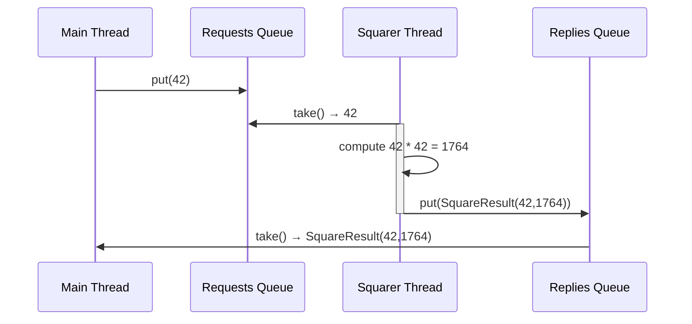

# Reading 22-Sockets & Networking

## Two models for concurrency

- In the **shared memory** model, concurrent modules interact by reading and writing shared mutable objects in memory. Creating multiple threads inside a single Java process is our primary example of shared-memory concurrency.
- In the **message passing** model, concurrent modules interact by sending immutable messages to one another over a communication channel. We’ve had one example of message passing so far: the [client/server pattern ](https://ocw.mit.edu/ans7870/6/6.005/s16/classes/21-sockets-networking/#clientserver_design_pattern), in which clients and servers are concurrent processes, often on different machines, and the communication channel is a [network socket ](https://ocw.mit.edu/ans7870/6/6.005/s16/classes/21-sockets-networking/#network_sockets).

The most important advantage of message passing model is **greater safety from bugs**.

In message-passing, concurrent modules interact *explicitly* , by passing messages through the communication channel, rather than *implicitly* through mutation of shared data.

 We’ll use **blocking queues** (an existing threadsafe type) to implement message passing between threads within a process.

## Message Passing with threads

Using a synchronized queue for message passing between threads. The queue serves the same function as the buffered network communication channel in client/server message passing. Java provides the `BlockingQueue` interface for queues with blocking operations:

In an ordinary `Queue`

- `add(e)` adds element `e` to the end of the queue
- `remove()` removes and returns the element at the head of the queue, or throws an exception if the queue is empty.

A `BlockingQueue` extends this interface:

> additionally supports operations that wait for the queue to become non-empty when retrieving an element, and wait for space to become available in the queue when storing an elemet.

- **`put(e) `**blocks until it can add element `e `to the end of the queue (if the queue does not have a size bound, `put `will not block).
- **`take()` **blocks until it can remove and return the element at the head of the queue, waiting until the queue is non-empty.

When you are using a `BlockingQueue `for message passing between threads, make sure to use the `put() `and `take() `operations, not ~~`add() `and `remove() `~~

Analogous to the client/server pattern for message passing over a network is the **producer-consumer design pattern** for message passing between threads.

> In a typical car manufacturing setup, the Producer-Consumer pattern facilitates synchronous operations, ensuring efficient assembly and installation processes. Imagine a car manufacturing plant where different stages of production occur. The "producer" could be the station that assembles car engines, while the "consumer" could be the station that installs the engines into car bodies. 
>
> The engines are placed onto a **conveyor belt (acting as a buffer)** once they are assembled. The installation station takes engines off the conveyor belt to install them into cars. 
>
> This allows the engine assembly and engine installation processes to operate **independently**, with the conveyor belt managing the synchronization between these two stages. If the assembly station produces engines faster than the installation station can install them, the excess engines are temporarily stored on the conveyor belt. Conversely, if the installation station needs engines but the assembly station is temporarily halted, it can still work on the engines available on the belt.

Java provides two implementations of `BlockingQueue`:

- [`ArrayBlockingQueue `](https://docs.oracle.com/javase/8/docs/api/?java/util/concurrent/ArrayBlockingQueue.html)is a fixed-size queue that uses an array representation. `put `ting a new item on the queue will block if the queue is full.
- [`LinkedBlockingQueue `](https://docs.oracle.com/javase/8/docs/api/?java/util/concurrent/LinkedBlockingQueue.html)is a growable queue using a linked-list representation. If no maximum capacity is specified, the queue will never fill up, so `put `will never block.

Unlike the streams of bytes sent and received by sockets, these synchronized queues (like normal collections classes in Java) can hold objects of an arbitrary type. Instead of designing a wire protocol, we must choose or design a type for messages in the queue. **It must be an immutable type.** And just as we did with operations on a threadsafe ADT or messages in a wire protocol, we must design our messages here to prevent race conditions and enable clients to perform the atomic operations they need.

## Implementing message passing with queues

You can see all the code for this example on GitHub: [**squarer example** ](https://github.com/mit6005/sp16-ex22-square). 

## Thread safety arguments with message passing

A thread safety argument with message passing might rely on:

- **Existing threadsafe data types** for the synchronized queue. This queue is definitely shared and definitely mutable, so we must ensure it is safe for concurrency.
- **Immutability** of messages or data that might be accessible to multiple threads at the same time.
- **Confinement** of data to individual producer/consumer threads. Local variables used by one producer or consumer are not visible to other threads, which only communicate with one another using messages in the queue.
- **Confinement** of mutable messages or data that are sent over the queue but will only be accessible to one thread at a time. This argument must be carefully articulated and implemented. But if one module drops all references to some mutable data like a hot potato as soon as it puts them onto a queue to be delivered to another thread, only one thread will have access to those data at a time, precluding concurrent access.

In comparison to synchronization, message passing can make it easier for each module in a concurrent system to maintain its own thread safety invariants. We don’t have to reason about multiple threads accessing shared data if the data are instead transferred between modules using a threadsafe communication channel.

## Summary

- Rather than synchronize with locks, message passing systems synchronize on a shared communication channel, e.g. a stream or a queue.
- Threads communicating with blocking queues is a useful pattern for message passing within a single process.