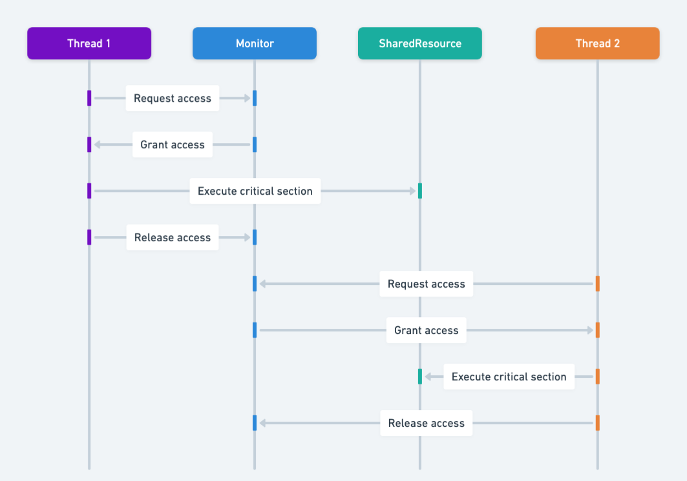

# Reading 23-Locks and Synchronization

## Introduction

Recall that we defined **thread safety** for a data type or a function as behaving correctly when used from multiple threads, regardless of how those threads are executed, without additional coordination.

Here is the general principle: **the correctness of a concurrent program should not depend on accidents of things.**

To achieve this, we have four strategies:

1. Confinement: don not share data between threads
2. Immutability: make the shared data immutable
3. Use existing threadsafe data types
4. **Synchronization**: prevent threads from accessing the shared data at the same time. This is what we use to implement a threadsafe type, but we didn't discuss it at the time.

## Synchronization

**The correctness of a concurrent program should not depend on accidents of timing.**

**Locks** are one synchronization technique. A lock is an abstraction that allows at most one thread to **own** it at a time. **Holding a lock** is how one thread tells other threads: "I am changing this thing, don not touch it right now."

Locks have two operations:

- `acquire` allows thread to take ownership of a  lock. If a thread tries to acquire a lock currently owned by another thread, it **blocks** until the other threads releases the lock. At most, one thread can own the lock at a time.
- `release` relinquishes ownership of the lock, allowing another thread to take ownership of it.

### Bank account example


In the diagram to the right, both A and B are trying to access account 1. Suppose B acquires the lock first. Then A must wait to read and write the balance until B finishes and releases the lock. This ensures that A and B are synchronized, but another cash machine C is able to run independently on a different account (because that account is protected by a different lock).

## Deadlock

It is possible to get into a situation where two threads are waiting for each other - and hence neither can make progress.


In the figure to the right, suppose A and B are making simultaneous transfers between two accounts in our bank.

A transfer between accounts needs to lock both accounts, so that money can not disappear from the system. A and B each acquires the lock on account 1, and B acquires the lock on account 2. Now, each must acquire the lock on their "to" account: so A is waiting for B to release the account 2 lock, and B is waiting for A to release the account 1 lock. 

**Deadlock** occurs when concurrent modules are stuck waiting for each other to do something. A deadlock may involve more than two modules: the signal feature of deadlock is a **cycle of dependencies**, e.g. A is waiting for B which is waiting for C which is waiting for A. 

You can also have deadlock without using any locks. For example, a message-passing system can experience deadlock when message buffers fill up. If a client fills up the server’s buffer with requests, and then *blocks* waiting to add another request, the server may then fill up the client’s buffer with results and then block itself. So the client is waiting for the server, and the server waiting for the client, and neither can make progress until the other one does. Again, deadlock ensues.

In the Java Tutorials, read:

- [Deadlock ](https://docs.oracle.com/javase/tutorial/essential/concurrency/deadlock.html)(1 page)

## Developing a threadsafe abstract data type

Let’s see how to use synchronization to implement a threadsafe ADT.

You can see all the code for this example on GitHub: [**edit buffer example** ](https://github.com/mit6005/sp16-ex23-editor).

Suppose we are building a multi-user editor, like Google Docs, that allows multiple people to connect to it and edit it at the same time. We'll need a mutable datatype to represent in the text in the document. Here's the interface; basically it represents a string with insert and delete operations:

```java
/** An EditBuffer represents a threadsafe mutable
 *  string of characters in a text editor. */
public interface EditBuffer {
    /**
     * Modifies this by inserting a string.
     * @param pos position to insert at
                      (requires 0 <= pos <= current buffer length)
     * @param ins string to insert
     */
    public void insert(int pos, String ins);

    /**
     * Modifies this by deleting a substring
     * @param pos starting position of substring to delete 
     *                (requires 0 <= pos <= current buffer length)
     * @param len length of substring to delete 
     *                (requires 0 <= len <= current buffer length - pos)
     */
    public void delete(int pos, int len);

    /**
     * @return length of text sequence in this edit buffer
     */
    public int length();

    /**
     * @return content of this edit buffer
     */
    public String toString();
}
```

A very simple rep for this datatype would just be a string:

[`SimpleBuffer.java`](https://github.com/mit6005/sp16-ex23-editor/blob/master/src/editor/SimpleBuffer.java)

```java
public class SimpleBuffer implements EditBuffer {
    private String text;
    // Rep invariant: 
    //   text != null
    // Abstraction function: 
    //   represents the sequence text[0],...,text[text.length()-1]
```

The downside of this rep is that every time we do an insert or delete, we have to copy the entire string into a new string. That gets expensive. 

Another rep we could use would be a character array, with space at the end. That’s fine if the user is just typing new text at the end of the document (we don’t have to copy anything), but if the user is typing at the beginning of the document, then we’re copying the entire document with every keystroke.

A more interesting rep, which is used by many text editors in practice, is called a *gap buffer* . It’s basically a character array with extra space in it, but instead of having all the extra space at the end, the extra space is a *gap* that can appear anywhere in the buffer. Whenever an insert or delete operation needs to be done, the datatype first moves the gap to the location of the operation, and then does the insert or delete. If the gap is already there, then nothing needs to be copied — an insert just consumes part of the gap, and a delete just enlarges the gap! **Gap buffers are particularly well-suited to representing a string that is being edited by a user with a cursor**, since inserts and deletes tend to be focused around the cursor, so the gap rarely moves.

```java
/** GapBuffer is a non-threadsafe EditBuffer that is optimized
 *  for editing with a cursor, which tends to make a sequence of
 *  inserts and deletes at the same place in the buffer. */
public class GapBuffer implements EditBuffer {
    private char[] a;
    private int gapStart;
    private int gapLength;
    // Rep invariant: 
    //   a != null
    //   0 <= gapStart <= a.length
    //   0 <= gapLength <= a.length - gapStart
    // Abstraction function: 
    //   represents the sequence a[0],...,a[gapStart-1],
    //                           a[gapStart+gapLength],...,a[length-1]
```

In a multiuser scenario, we’d want multiple gaps, one for each user’s cursor, but we’ll use a single gap for now.

### Steps to develop the datatype

Recall our recipe for designing and implementing an ADT:

1. **Specify**. Define the operations (method signitures and spec). We did that in the `EditBuffer` interface.
2. **Test**. Develop test cases for the operations. See `EditBufferTest` in the provided code. The test suite includes a testing strategy based on partitioning the parameter space of the operations.
3. **Rep**. Choose a rep. We choose two of them for `EditBuffer`, and this is often a good idea:
   - **Implement a simple, brute-force rep first**
   - **Write down the rep invariant and abstraction function, and implement `checkRep()`**
4. **Synchronize**. Make an argument that your rep is threadsafe. Write it down explicitly as a comment in your class, right by the rep invariant, so that a maintainer knows how you designed thread safety into the class. 

This part of the reading is about how to do step 4. We already saw [how to make a thread safety argument ](https://ocw.mit.edu/ans7870/6/6.005/s16/classes/20-thread-safety/#how_to_make_a_safety_argument), but this time, we’ll rely on synchronization in that argument.

5. **Iterate**. You may find that your choice of operations makes it hard to write a threadsafe type with the guarantees clients require. You might discover this in step 1, or in step 2 when you write tests, or in step 3 or 4 when you implement. If that's the case, go back and refine the set of operations your ADT provides.

## Locking 

In Java, every object has a lock implicitly associated with it - a `String`, an array, an `ArrayList`, and every class you create, all of their object instances have a lock. Even a humble `Object `has a lock, so bare `Object `s are often used for explicit locking:

```java
Object lock = new Object();
```

You can’t call `acquire `and `release `on Java’s intrinsic locks, however. Instead you use the **`synchronized `**statement to acquire the lock for the duration of a statement block:

```java
synchronized (lock) { // thread blocks here until lock is free
    // now this thread has the lock
    balance = balance + 1;
    // exiting the block releases the lock
}
```

Synchronized regions like this provide **mutual exclusion**: only one thread at a time can be in a synchronized region guarded by a given object's lock.

### Locks guard access to data

Locks are used to **guard** a shared data variable, like the account balance shown here. If all accesses to a data are guarded (surrounded by a synchronized block) by the same lock object, then those accesses will be guaranteed bt be atomic - uninterrupted by other threads.

Because every object in Java has a lock implicitly associated with it, you might think that simply owing an object's lock would preven t other threads from accessing that object. **That is not the case**. Acquiring the lock associated with object `obj` using 

```java
synchronized (obj) {...}
```

in thread *t* does one thing and one thing only: prevents other threads from entering `synchronized(obj)` block, until thread *t* finishes its synchronized block. That's it.

Locks only provide mutual exclusion with other threads that acquire the same lock. All accesses to a data variable must be guarded by the same lock. You might guard an entire collection of variables behind a single lock, but all modules must agree on which lock they will all acquire and release.

## Monitor pattern

Real-world example

> Imagine a shared office printer that several employees need to use. The printer can only handle one print job at a time to avoid mixing up pages from different documents. This scenario is analogous to the Monitor design pattern in programming.
>
> In this example, the printer represents the shared resource, and the employees are analogous to threads. A system is set up where each employee must request access to the printer before starting their print job. This system ensures that only one employee (or "thread") can use the printer at a time, preventing any overlap or interference between jobs. Once a print job is complete, the next employee in the queue can access the printer. This mechanism mirrors the Monitor pattern's way of controlling access to a shared resource, ensuring orderly and safe use by multiple "threads" (employees).

In plain words

> Monitor pattern is used to enforce single-threaded access to data. Only one thread at a time is allowed to execute code within the monitor object.




When you are writing methods of a class, the most convenient lock is the object instance itself, i.e. `this `. As a simple approach, we can guard the entire rep of a class by wrapping all accesses to the rep inside `synchronized (this) `.

```java
/** SimpleBuffer is a threadsafe EditBuffer with a simple rep. */
public class SimpleBuffer implements EditBuffer {
    private String text;
    ...
    public SimpleBuffer() {
        synchronized (this) {
            text = "";
            checkRep();
        }
    }
    public void insert(int pos, String ins) {
        synchronized (this) {
            text = text.substring(0, pos) + ins + text.substring(pos);
            checkRep();
        }
    }
    public void delete(int pos, int len) {
        synchronized (this) {
            text = text.substring(0, pos) + text.substring(pos+len);
            checkRep();
        }
    }
    public int length() {
        synchronized (this) {
            return text.length();
        }
    }
    public String toString() {
        synchronized (this) {
            return text;
        }
    }
}
```

Note the very careful discipline here. ***Every* method that touches the rep must be guarded with the lock — even apparently small and trivial ones like `length() `and `toString() `. This is because reads must be guarded as well as writes — if reads are left unguarded, then they may be able to see the rep in a partially-modified state.**

This approach is called the **monitor pattern** . A monitor is a class whose methods are mutually exclusive, so that only one thread can be inside an instance of the class at a time.

Java provides some syntactic sugar for the monitor pattern. If you add the keyword `synchronized `to a method signature, then Java will act as if you wrote `synchronized (this) `around the method body. So the code below is an equivalent way to implement the synchronized `SimpleBuffer `:

```java
/** SimpleBuffer is a threadsafe EditBuffer with a simple rep. */
public class SimpleBuffer implements EditBuffer {
    private String text;
    ...
    public SimpleBuffer() {
        text = "";
        checkRep();
    }
    public synchronized void insert(int pos, String ins) {
        text = text.substring(0, pos) + ins + text.substring(pos);
        checkRep();
    }
    public synchronized void delete(int pos, int len) {
        text = text.substring(0, pos) + text.substring(pos+len);
        checkRep();
    }
    public synchronized int length() {
        return text.length();
    }
    public synchronized String toString() {
        return text;
    }
}
```

Notice that the `SimpleBuffer `constructor doesn’t have a `synchronized `keyword. Java actually forbids it, syntactically, because an object under construction is expected to be confined to a single thread until it has returned from its constructor. So synchronizing constructors should be unnecessary.

In the Java Tutorials, read:

- [Synchronized Methods ](https://docs.oracle.com/javase/tutorial/essential/concurrency/syncmeth.html)(1 page)
- [Intrinsic Locks and Synchronization ](https://docs.oracle.com/javase/tutorial/essential/concurrency/locksync.html)(1 page)

> Making methods synchronized has two effects:
>
> 1. It is not possible for two invocations of synchronized methods on the same object to interleave.
> 2. When a sychronized method exists, it automatically establishes a happens-before relationship with *any subsequent invocation* of a synchronized method for the same object.

## Thread safety argument with synchronization

Now that we’re protecting `SimpleBuffer `’s rep with a lock, we can write a better thread safety argument:

```java
/** SimpleBuffer is a threadsafe EditBuffer with a simple rep. */
public class SimpleBuffer implements EditBuffer {
    private String text;
    // Rep invariant: 
    //   text != null
    // Abstraction function: 
    //   represents the sequence text[0],...,text[text.length()-1]
    // Thread safety argument:
    //   all accesses to text happen within SimpleBuffer methods,
    //   which are all guarded by SimpleBuffer's lock
```

The same argument works for `GapBuffer `, if we use the monitor pattern to synchronize all its methods.

Note that the encapsulation of the class, the absence of rep exposure, is very important for making this argument. If text were public:

```java
    public String text;
```

then clients outside `SimpleBuffer `would be able to read and write it without knowing that they should first acquire the lock, and `SimpleBuffer `would no longer be threadsafe.

> Locks ensure safe method-based access, but they cannot prevent unsafe **direct** access. That is why **encapsulation (private fields) + synchronization (locks)** must go to achieve real thread safety

### Locking discipline

A locking discipline is a strategy for ensuring that synchronized code is threadsafe. We must satisfy two conditions:

1. Every shared mutable variable must be guarded by some lock. The data may not be read or written except inside a synchronized block that acquires that lock.
2. If an variant involves multiple shared mutable variables (which might even be in different objects), then all the variables involved must be guarded by the **same** lock. Once a thread acquires the lock, the invariant must be reestablished before releasing the lock.

The monitor pattern as used here satisfies both rules. All the shared mutable data in the rep - which the rep invariant depends on - are guarded by the same lock.

## Atomic operations

Consider a find-and-replace operation on the `EditBuffer` type:

```java
/** Modifies buf by replacing the first occurrence of s with t.
 *  If s not found in buf, then has no effect.
 *  @returns true if and only if a replacement was made
 */
public static boolean findReplace(EditBuffer buf, String s, String t) {
    int i = buf.toString().indexOf(s);
    if (i == -1) {
        return false;
    }
    buf.delete(i, s.length());
    buf.insert(i, t);
    return true;
}
```

To prevent other threads from mutating the buffer while `findReplace` is working, `findReplace` needs to synchronize with all other clients of `buf`.

### Giving clients access to a lock

If you want to give clients the rights to implement higer-level atomic operations by synchronization, you should document in the specification.

```java
/** An EditBuffer represents a threadsafe mutable string of characters
 *  in a text editor. Clients may synchronize with each other using the
 *  EditBuffer object itself. */
public interface EditBuffer {
   ...
}
```

And then `findReplace` can synchronize on `buf`:

```java
public static boolean findReplace(EditBuffer buf, String s, String t) {
    synchronized (buf) {
        int i = buf.toString().indexOf(s);
        if (i == -1) {
            return false;
        }
        buf.delete(i, s.length());
        buf.insert(i, t);
        return true;
    }
}
```
### Sprinking `synchronized` everywhere?

So is thread safety simply a matter of putting the `synchronized` keyword on every method in your program? Unfortunately not!

First, synchronization imposes a large cost on your program. 

Another argument for using `synchronized` in a more deliberate way is that it minimizeds the scope of access to your lock. Adding `synchronized` to every method means that your lock is the object itself, and every client with a reference to your object automatically has a reference to your lock, that it can acquire and release at will. Your thread safety mechanism is therefore public and can be interfered with by clients.

For example, we have a class:

```java
class Counter {
    private int count = 0;

    public synchronized void increment() {
        count++;
    }
}
```

Any client holding a reference to the object can also lock it:

```java
Counter c = new Counter();

synchronized(c) {  
    Thread.sleep(10000); // deliberately hold the lock for 10 s
}
```

To avoid this, we have an alternative plan: create a dedicated private lock:

```java
private final Object lock = new Object();
public void foo() {
    synchronized(lock) {
        ...
    }
}
```

Finally, it's not actually sufficient to sprinkle `synchronized` everywhere. 

Dropping synchronized onto a method without thinking means that you’re acquiring a lock without thinking about which lock it is, or about whether it’s the right lock for guarding the shared data access you’re about to do. Suppose we had tried to solve findReplace ’s synchronization problem simply by dropping synchronized onto its declaration:

```java
public static synchronized boolean findReplace(EditBuffer buf, ...) {
```

This wouldn’t do what we want. It would indeed acquire a lock — because findReplace is a static method, it would acquire a static lock for the whole class that findReplace happens to be in, rather than an instance object lock.

As a result, only one thread could call findReplace at a time — even if other threads want to operate on different buffers, which should be safe, they’d still be blocked until the single lock was free. So we’d suffer a significant loss in performance, because only one user of our massive multiuser editor would be allowed to do a find-and-replace at a time, even if they’re all editing different documents.

Worse, however, it wouldn’t provide useful protection, because other code that touches the document probably wouldn’t be acquiring the same lock. It wouldn’t actually eliminate our race conditions. 

> The synchronized keyword is not a panacea. Thread safety requires a discipline — using **confinement, immutability, or locks** to protect shared data. And that discipline needs to be written down, or maintainers won’t know what it is.

## Deadlock rears its ugly head

The locking approach to thread safety is powerful, but (unlike confinement and immutability) it introduces blocking into the program. And blocking raises the possibility of deadlock - a very real risk, and frankly far more common in this setting.

With locking, deadlock happens when threads acquire mutliple locks at the same time, and two threads end up blocked while holding locks that they are each waiting for the other to release.  The monitor pattern  unfortunately makes this fairly easy to do. Here is an example:

```java
public class Wizard {
    private final String name;
    private final Set<Wizard> friends;
    // Rep invariant:
    //    name, friends != null
    //    friend links are bidirectional: 
    //        for all f in friends, f.friends contains this
    // Concurrency argument:
    //    threadsafe by monitor pattern: all accesses to rep 
    //    are guarded by this object's lock

    public Wizard(String name) {
        this.name = name;
        this.friends = new HashSet<Wizard>();
    }

    public synchronized boolean isFriendsWith(Wizard that) {
        return this.friends.contains(that);
    }

    public synchronized void friend(Wizard that) {
        if (friends.add(that)) {
            that.friend(this);
        } 
    }

    public synchronized void defriend(Wizard that) {
        if (friends.remove(that)) {
            that.defriend(this);
        } 
    }
}
```

Like Facebook, this social network is bidirectional: if *x* is friends with *y* , then *y* is friends with *x* . The `friend() `and `defriend() `methods enforce that invariant by modifying the reps of both objects, which because they use the monitor pattern means acquiring the locks to both objects as well.

Let’s create a couple of wizards:

```java
    Wizard harry = new Wizard("Harry Potter");
    Wizard snape = new Wizard("Severus Snape");
```

And then think about what happens when two independent threads are repeatedly running:

```java
    // thread A                   // thread B
    harry.friend(snape);          snape.friend(harry);
    harry.defriend(snape);        snape.defriend(harry);
```

We will deadlock very rapidly. Here’s why. Suppose thread A is about to execute `harry.friend(snape) `, and thread B is about to execute `snape.friend(harry) `.

- Thread A acquires the lock on `harry `(because the friend method is synchronized).
- Then thread B acquires the lock on `snape `(for the same reason).
- They both update their individual reps independently, and then try to call `friend() `on the other object — which requires them to acquire the lock on the other object.

So A is holding Harry and waiting for Snape, and B is holding Snape and waiting for Harry. Both threads are stuck in `friend() `, so neither one will ever manage to exit the synchronized region and release the lock to the other. This is a classic deadly embrace. The program simply stops.

The essence of the problem is acquiring multiple locks, and holding some of the locks while waiting for another lock to become free.

Notice that it is possible for thread A and thread B to interleave such that deadlock does not occur: perhaps thread A acquires and releases both locks before thread B has enough time to acquire the first one. If the locks involved in a deadlock are also involved in a race condition — and very often they are — then the deadlock will be just as difficult to reproduce or debug.

### Deadlock solution 1: lock ordering

One way to prevent deadlock is to put an ordering on the locks that need to be acquired simultaneously, and ensuring that all codde acquires the locks in that order.

In our social network example, we might always acquire the locks on the `Wizard `objects in **alphabetical** order by the wizard’s name. Since thread A and thread B are both going to need the locks for Harry and Snape, they would both acquire them in that order: Harry’s lock first, then Snape’s. If thread A gets Harry’s lock before B does, it will also get Snape’s lock before B does, because B can’t proceed until A releases Harry’s lock again. The ordering on the locks forces an ordering on the threads acquiring them, so there’s no way to produce a cycle in the waiting-for graph.

Here’s what the code might look like:

```java
    public void friend(Wizard that) {
        Wizard first, second;
        if (this.name.compareTo(that.name) < 0) {
            first = this; second = that;
        } else {
            first = that; second = this;
        }
        synchronized (first) {
            synchronized (second) {
                if (friends.add(that)) {
                    that.friend(this);
                } 
            }
        }
    }
```

(Note that the decision to order the locks alphabetically by the person’s name would work fine for this book, but it wouldn’t work in a real life social network. Why not? What would be better to use for lock ordering than the name? - Because name might be changed !!!)

Although lock ordering is useful (particularly in code like operating system kernels), it has a number of drawbacks in practice.

- First, it’s not modular — the code has to know about all the locks in the system, or at least in its subsystem.
- Second, it may be difficult or impossible for the code to know exactly which of those locks it will need before it even acquires the first one. It may need to do some computation to figure it out. Think about doing a depth-first search on the social network graph, for example — how would you know which nodes need to be locked, before you’ve even started looking for them?

### Deadlock solution 2: coarse-grained locking

A more common approach than lock ordering, particularly for application programming (as opposed to operating system or device driver programming), is to use coarser locking — use a single lock to guard many object instances, or even a whole subsystem of a program.

For example, we might have a single lock for an entire social network, and have all the operations on any of its constituent parts synchronize on that lock. In the code below, all `Wizard `s belong to a `Castle `, and we just use that `Castle `object’s lock to synchronize:

```java
public class Wizard {
    private final Castle castle;
    private final String name;
    private final Set<Wizard> friends;
    ...
    public void friend(Wizard that) {
        synchronized (castle) {
            if (this.friends.add(that)) {
                that.friend(this);
            }
        }
    }
}
```

Coarse-grained locks can have a significant performance penalty. If you guard a large pile of mutable data with a single lock, then you’re giving up the ability to access any of that data concurrently. In the worst case, having a single lock protecting everything, your program might be essentially sequential — only one thread is allowed to make progress at a time.

## Goals of concurrent program design

Now is a good time to pop up a level and look at what we’re doing. Recall that our primary goals are to create software that is **safe from bugs** , **easy to understand** , and **ready for change** .

Building concurrent software is clearly a challenge for all three of these goals. We can break the issues into two general classes. When we ask whether a concurrent program is *safe from bugs* , we care about two properties:

- **Safety.** Does the concurrent program satisfy its invariants and its specifications? Races in accessing mutable data threaten safety. Safety asks the question: can you prove that **some bad thing never happens** ?
- **Liveness.** Does the program keep running and eventually do what you want, or does it get stuck somewhere waiting forever for events that will never happen? Can you prove that **some good thing eventually happens** ?

Deadlocks threaten liveness. Liveness may also require *fairness* , which means that concurrent modules are given processing capacity to make progress on their computations. Fairness is mostly a matter for the operating system’s thread scheduler, but you can influence it (for good or for ill) by setting thread priorities.

## Concurrency in practice

What strategies are typically followed in real programs?

- **Library data structures** either use no synchronization (to offer high performance to single-threaded clients, while leaving it to multithreaded clients to add locking on top) or the monitor pattern.
- **Mutable data structures with many parts** typically use either coarse-grained locking or thread confinement. Most graphical user interface toolkits follow one of these approaches, because a graphical user interface is basically a big mutable tree of mutable objects. Java Swing, the graphical user interface toolkit, uses thread confinement. Only a single dedicated thread is allowed to access Swing’s tree. Other threads have to pass messages to that dedicated thread in order to access the tree.
- **Search** often uses immutable datatypes. Our [Boolean formula satisfiability search ](https://ocw.mit.edu/ans7870/6/6.005/s16/classes/16-recursive-data-types/recursive/#another_example_boolean_formulas)would be easy to make multithreaded, because all the datatypes involved were immutable. There would be no risk of either races or deadlocks.
- **Operating systems** often use fine-grained locks in order to get high performance, and use lock ordering to deal with deadlock problems.

## Summary

Producing a concurrent program that is safe from bugs, easy to understand, and ready for change requires careful thinking. Heisenbugs will skitter away as soon as you try to pin them down, so debugging simply isn’t an effective way to achieve correct threadsafe code. And threads can interleave their operations in so many different ways that you will never be able to test even a small fraction of all possible executions.

- Make thread safety arguments about your datatypes, and document them in the code.
- Acquiring a lock allows a thread to have exclusive access to the data guarded by that lock, forcing other threads to block — as long as those threads are also trying to acquire that same lock.
- The monitor pattern guards the rep of a datatype with a single lock that is acquired by every method.
- Blocking caused by acquiring multiple locks creates the possibility of deadlock.

