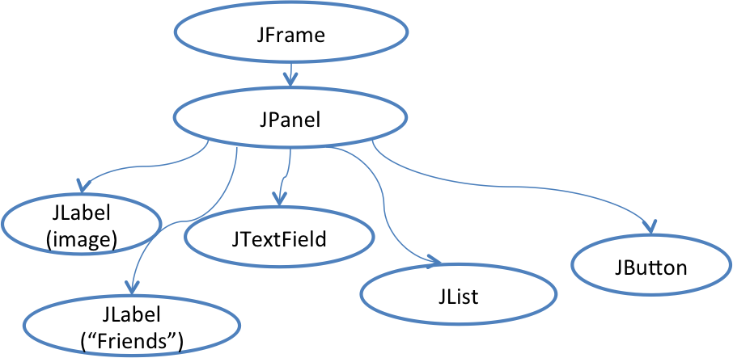
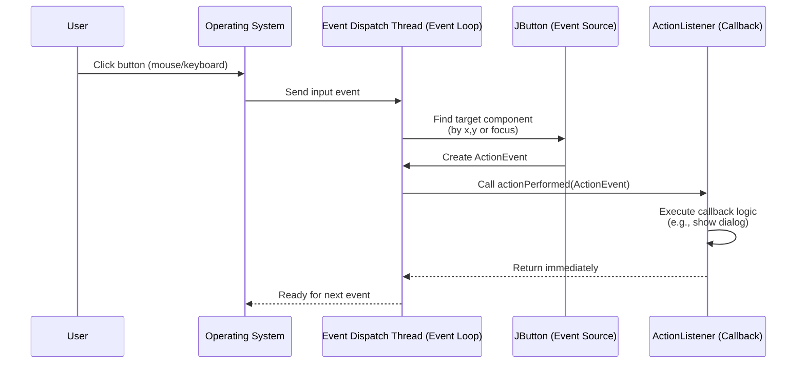
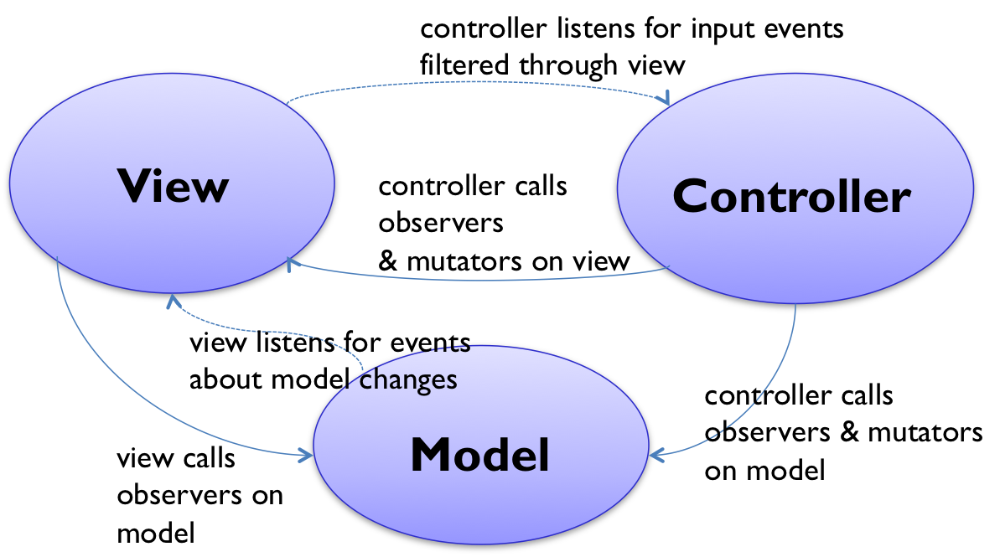
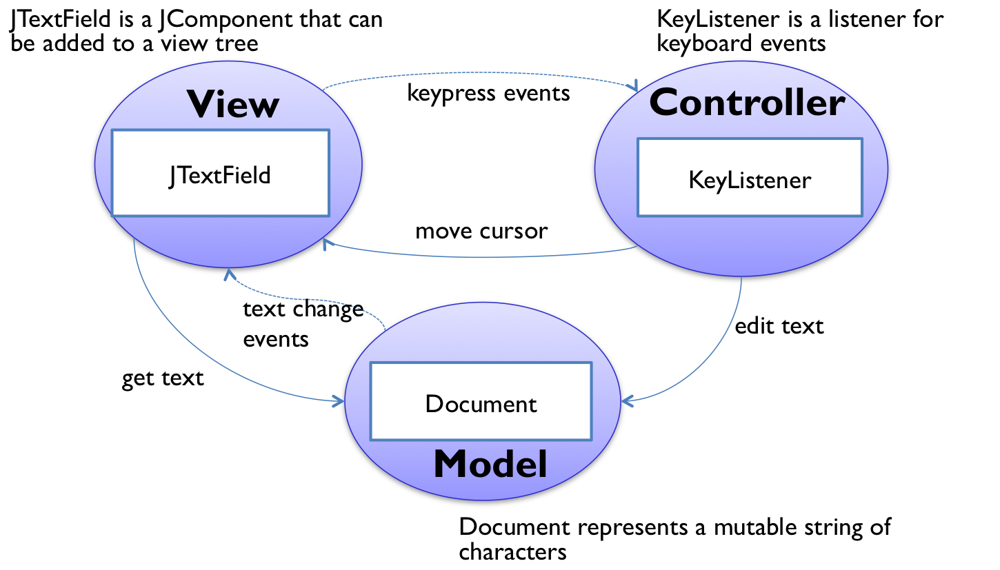

# Reading 24-Graphical User Interfaces

We will take a high-level look at the software architecture of GUI software, focusing on the design patterns that have proven most useful. Three of the most important patterns are:

- the view tree, which is a central feature in the architecture of every important GUI toolkit;
- the model-view-controller pattern, which separates input, output, and data;
- the listener pattern, which is essential to decoupling the model from the view and controller.

## View Tree




Views are arranged into a hierarchy of containment, in which some views contain other views. Typical containers are windows, panels, and toolbars. The view tree is not just an arbitrary hierarchy, but is in fact a spatial one: child views are nested inside their parent's bounding box.

The desgin pattern here is called **view tree**.

## How the View Tree is Used

The view tree is a powerful structuring idea, which is loaded with responsibilities in a typical GUI:

**Output**. Views are responsible for displaying themselves, and the view tree directs the display process. The view tree controls how the entire interface is drawn: GUI changes are made by mutating the tree; redraw starts from the root, recursively calling `paint()` on child nodes.

**Input**. The view tree controls how mouse/keyboard events are dispatched. System first finds which view was hit (based on coordinates). Then, the event is sent to the correct node's handler (`onClick`, `onKeyPress`).

**Layout**. The view tree manages bounding boxes of views by using automatic layout algorithms. First, specialized containers (e.g., `JSplitPane`, `JScrollPane`) compute layout themselves. Generic containers (`JPanel`, `JFrame`) delegate to a Layout Manager (`BorderLayout`, `BoxLayout`, etc.). Thus, developers focus on layout rules, not pixel-level placement.

## Input Handling

Input is handled somewhat differently in GUIs than we’ve been handling it in parsers and servers. In those systems, we’ve seen a single parser that peels apart the input and decides how to direct it to different modules of the program. If a GUI were written that way, it might look like this (in pseudocode):

```java
while (true) {
    read mouse click
    if (clicked on Thrash button) doThrash();
    else if (clicked on textbox) doPlaceCursor();
    else if (clicked on a name in the listbox) doSelectItem();
    ...
}
```

In a GUI, we do not directly write this kind of method, because it is not modular - it mixes up responsibilities for button, listbox, and textbox all in one place. Instead, GUIs exploit the spatial keyboard events are distributed around the view tree, depending on where they occur.

GUI input event handling is an instance of the **Listener pattern** (also known as Publish-Subscribe). In the Listener pattern:

- An **event source** (e.g. mouse, keyboard...) generates a stream of discrete events, which correspond to state transitions in the source.
- One or more **listeners** register interest (subscribe) to the stream of events, providing a function to be called when a new event occurs.

When an event occurs, the source **notifies all listeners** by calling their callback methods.

```java
import javax.swing.*;
import java.awt.event.*;

public class ListenerPatternExample {
    public static void main(String[] args) {
        // 1. Create a window (the top-level container)
        JFrame frame = new JFrame("Listener Pattern Demo");
        frame.setSize(300, 200);
        frame.setDefaultCloseOperation(JFrame.EXIT_ON_CLOSE);

        // 2. Create a button (event source)
        JButton button = new JButton("Click Me");

        // 3. Register a listener (subscribe to the event)
        button.addActionListener(new ActionListener() {
            @Override
            public void actionPerformed(ActionEvent e) {
                // 4. Callback logic when the event happens
                System.out.println("Button was clicked!");
                JOptionPane.showMessageDialog(frame, "You clicked the button!");
            }
        });

        // 5. Add button to the window
        frame.add(button);

        // 6. Show the window
        frame.setVisible(true);
    }
}
```



## Separaing Frontend from Backend

The **Model-View-Controller pattern** has this separation of concerns as its primary goal. It separates the user interface frontend from the application backend, by putting backend code into the model and frontend code into the view and controller. MVC also separates input from output; the controller is supposed to handle input, and the view is supposed to handle output.



> - The model is responsible for managing the data of the application. It receives user input from the controller.
> - The view renders presentation of the model in a particular format.
> - The controller responds to the user input and performs interactions on the data model objects. The controller receives the input, optionally validates it and then passes the input to the model.

The **model** is responsible for maintaining application-specific data and providing access to that data. Models are often **mutable**, and they provide methods for changing the state safely, preserving its **representation invariants**. OK, all mutable objects do that. But a model must also notify its clients when there are changes to its data, so that dependent views can update their displays, and dependent controllers can respond appropriately. Models do this notification using the **listener pattern**, in which interested views and controllers register themselves as listeners for change events generated by the model.

**View** objects are responsible for output. A view usually occupies some chunk of the screen, usually a rectangular area. Basically, the view queries the model for data and draws the data on the screen. It listens for changes from the model so that it can update the screen to reflect those changes.

Finally, the **controller** handles the input. It receives keyboard and mouse events, and instructs the model to change accordingly.



A simple example of the MVC pattern is a text field. The figure at right shows Java Swing’s text field, called `JTextField `. Its model is a mutable string of characters. The view is an object that draws the text on the screen (usually with a rectangle around it to indicate that it’s an editable text field). The controller is an object that receives keystrokes typed by the user and inserts them into the mutable string.

> Advantages:
>
> 1. Multiple views showing the same application data
> 2. enables the creation of user interface toolkits, which are libraries of reusable views

## Background Processing in Graphical User Interfaces

The last major topic for today connects back to **concurrency.**

#### Motivation

Many programs need to do operations that may take some time: retrieving URLs over the network, running database queries, scanning a filesystem, etc.

Input handing and screen repainting both happen in **one thread**: the ETD (Event-Dispatch Thread). The ETD:

- reads events from the queue
- dispatches them to listeners in the view tree
- repaints the screen when no events are pending

In Java, the **EDT is separated** from the program's main thread. The EDT starts autamatically when a GUI object is created. Most Swing apps:

- Main thread: initializes the view, then exists.
- EDT: responsible for all GUI work

Swing's view tree is not threadsafe - no gurantee of internal locks protecting it. By design, Swing avoids complex locks and instead enforces a **single-thread confinement rule**: only the EDT may read or write Swing components. Any access from other threads is forbidden by the specification.

There is a safe way to update the UI: developers can submit `Runnable` tasks into the **event queue** of Swing. 

- Use `SwingUtilities.invokeLater()` (or `invokeAndWait`) to enqueue UI-updating tasks:

```java
SwingUtilities.invokeLater(new Runnable() {
    public void run() {
        content.add(thumbnail); // safe UI update on EDT
        content.revalidate();
        content.repaint();
    }
});
```

- `invokeLater()`:
  - Places task at the end of the event queue.
  - EDT eventually picks it up and runs it.
  - Ensures the UI update happens inside the EDT → safe.

## Summary

- The view tree organizes the screen into a tree of nested rectangles, and it is used in dispatching input events as well as displaying output.
- The Listener pattern sends a stream of events (like mouse or keyboard events, or button action events) to registered listeners.
- The Model-View-Controller pattern separates responsibilities: model=data, view=output, controller=input.
- Long-running processing should be moved to a **background thread**, but the Swing view tree is confined to the event-dispatch thread. So accessing Swing objects from another thread requires using the event loop as a message-passing queue, to get back to the event-dispatch thread.

