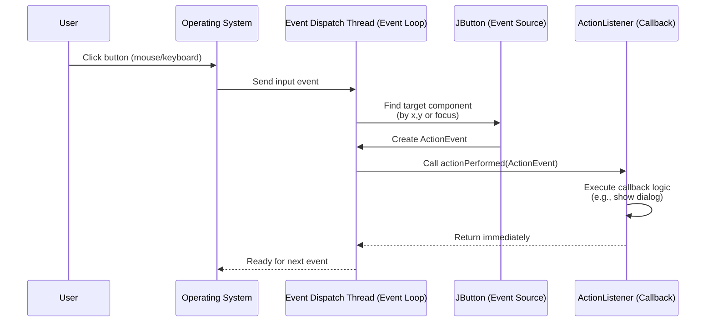

# Reading 24-Graphical User Interfaces

We will take a high-level look at the software architecture of GUI software, focusing on the design patterns that have proven most useful. Three of the most important patterns are:

- the view tree, which is a central feature in the architecture of every important GUI toolkit;
- the model-view-controller pattern, which separates input, output, and data;
- the listener pattern, which is essential to decoupling the model from the view and controller.

## View Tree


Views are arranged into a hierarchy of containment, in which some views contain other views. Typical containers are windows, panels, and toolbars. The view tree is not just an arbitrary hierarchy, but is in fact a spatial one: child views are nested inside their parent's bounding box.

The desgin pattern here is called **view tree**.

## How the View Tree is Used

The view tree is a powerful structuring idea, which is loaded with responsibilities in a typical GUI:

**Output**. Views are responsible for displaying themselves, and the view tree directs the display process. The view tree controls how the entire interface is drawn: GUI changes are made by mutating the tree; redraw starts from the root, recursively calling `paint()` on child nodes.

**Input**. The view tree controls how mouse/keyboard events are dispatched. System first finds which view was hit (based on coordinates). Then, the event is sent to the correct node's handler (`onClick`, `onKeyPress`).

**Layout**. The view tree manages bounding boxes of views by using automatic layout algorithms. First, specialized containers (e.g., `JSplitPane`, `JScrollPane`) compute layout themselves. Generic containers (`JPanel`, `JFrame`) delegate to a Layout Manager (`BorderLayout`, `BoxLayout`, etc.). Thus, developers focus on layout rules, not pixel-level placement.

## Input Handling

Input is handled somewhat differently in GUIs than we’ve been handling it in parsers and servers. In those systems, we’ve seen a single parser that peels apart the input and decides how to direct it to different modules of the program. If a GUI were written that way, it might look like this (in pseudocode):

```java
while (true) {
    read mouse click
    if (clicked on Thrash button) doThrash();
    else if (clicked on textbox) doPlaceCursor();
    else if (clicked on a name in the listbox) doSelectItem();
    ...
}
```

In a GUI, we do not directly write this kind of method, because it is not modular - it mixes up responsibilities for button, listbox, and textbox all in one place. Instead, GUIs exploit the spatial keyboard events are distributed around the view tree, depending on where they occur.

GUI input event handling is an instance of the **Listener pattern** (also known as Publish-Subscribe). In the Listener pattern:

- An **event source** (e.g. mouse, keyboard...) generates a stream of discrete events, which correspond to state transitions in the source.
- One or more **listeners** register interest (subscribe) to the stream of events, providing a function to be called when a new event occurs.

When an event occurs, the source **notifies all listeners** by calling their callback methods.

```java
import javax.swing.*;
import java.awt.event.*;

public class ListenerPatternExample {
    public static void main(String[] args) {
        // 1. Create a window (the top-level container)
        JFrame frame = new JFrame("Listener Pattern Demo");
        frame.setSize(300, 200);
        frame.setDefaultCloseOperation(JFrame.EXIT_ON_CLOSE);

        // 2. Create a button (event source)
        JButton button = new JButton("Click Me");

        // 3. Register a listener (subscribe to the event)
        button.addActionListener(new ActionListener() {
            @Override
            public void actionPerformed(ActionEvent e) {
                // 4. Callback logic when the event happens
                System.out.println("Button was clicked!");
                JOptionPane.showMessageDialog(frame, "You clicked the button!");
            }
        });

        // 5. Add button to the window
        frame.add(button);

        // 6. Show the window
        frame.setVisible(true);
    }
}
```



