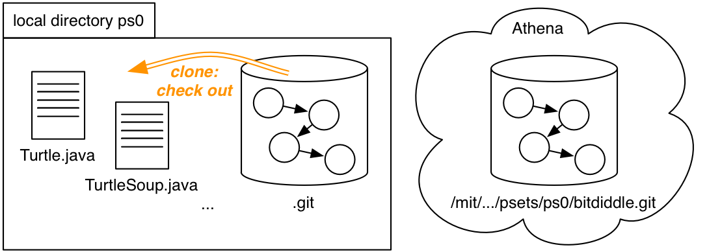

# Version Control

https://ocw.mit.edu/ans7870/6/6.005/s16/classes/05-version-control/

## Scheme

- **reverting** to a past version
- **comparing** two different versions
- **pushing** full version history to another location
- **pulling** history back from that location
- **mergeing** versions that are offshoots of the same earlier version

## Version control terminology

- **Repository:** a local or remote store of the versions in our project
- **Working copy:** a local, editable copy of our project that we can work on
- **File:** a single file in our project
- **Version** or **revision:** a record of the contents of our project at a point in time
- **Change** or **diff:** the difference between two versions
- **Head:** the current version

## Features of a version control system

- **Reliable** : keep versions around for as long as we need them; allow backups
- **Multiple files** : track versions of a project, not single files
- **Meaningful versions** : what were the changes, why where they made?
- **Revert** : restore old versions, in whole or in part
- **Compare versions**
- **Review history** : for the whole project or individual files
- **Not just for code** : prose, images, …

It should **allow multiple people to work together** :

- **Merge** : combine versions that diverged from a common previous version
- **Track responsibility** : who made that change, who touched that line of code?
- **Work in parallel** : allow one programmer to work on their own for a while (without giving up version control)
- **Work-in-progress** : allow multiple programmers to share unfinished work (without disrupting others, without giving up version control

## Git

### Object Graph

**The object graph** in Git is the fundamental data structure that records all versions (commits) and changes in a Git repository. It is a **directed acyclic graph (DAG)** stored inside the `.git` directory of your project.

**Nodes:** Each node in the object graph is a Git object (usually a commit, but also blobs, trees, and tags).

- **Commit objects** represent snapshots of the entire project at a point in time.
- **Blobs** store file contents.
- **Trees** represent directory structures.
- **Tags** label specific commits.

**Edges:** Each commit (except the first) points to one or more parent commits, creating a directed graph. Merges create commits with two (or more) parents.

**Branches:** A branch is simply a named pointer to a commit in the graph (often called `master` or `main` in simple projects).

**HEAD:** This is a special pointer that indicates your current position in the graph (usually, the tip of your current branch)

### Copy an object graph with `git clone`



```shell
git clone ssh://.../psets/ps0/bitdiddle.git ps0
```

1. Create an empty local directory `ps0`, and `ps0/.git`.
2. Copy the object graph from `ssh://.../psets/ps0/bitdiddle.git` into `ps0/.git`
3. **Check out** the current version of the `master` branch


### Add to the object graph with `git commit`


### Send & receive object graphs with `git push` & `git pull`

```shell
git push origin master
```

1. When we clone a repo, we obtain a copy of the history graph. Git remembers where we cloned from as a **remote repo** called **origin**.
2. Using `git commit`, we add new commits to the local history on the `master` branch.
3. To send those changes back to the `origin` remote, use `git push origin master`


### Mergeing

see: https://ocw.mit.edu/ans7870/6/6.005/s16/classes/05-version-control/