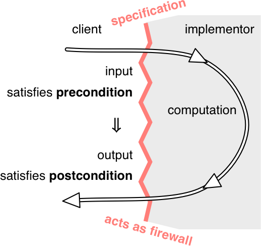

# Specifications



A speccification of a method consists of several clauses:

- A **precondition**, indicated by the keyword *requires*
- A **postcondition**, indicated by the keyword *effects*

If the precondition does not hold when the method is called, the implementation  is not bound by the postcondition.

## Specifications in Java

```java
/**
 * Find a value in an array.
 * @param arr array to search, requires that val occurs exactly once
 *            in arr
 * @param val value to search for
 * @return index i such that arr[i] = val
 */
static int find(int[] arr, int val)
```

## Null references

In Java, references to objects and arrays can also take on the special value `null`, which means that the reference doesn't point to an object.

- Primitives cannot be null

  ```java
  int size = null; // illegal 
  double depth = null; // illegal
  ```

- We can assign null to any non-primitive variable

  ```java
  String name = null;
  int[] points = null;
  ```

But you will get errors at runtime because you can not call any methods or use any fields with one of these references

Null values are troublesome an unsafe, so much so that you are well advised to remove them from your design vocabulary.

There are extensions to Java that allow you to forbid `null` directly in the type declaration, e.g.:

```java
static boolean addAll(@NonNull List<T> list1, @NonNull List<T> list2)
```

## Testing and specifications

The most important to note is that **even glass box tests must follow the specification.** 

## Exceptions

### Exceptioins for signaling bugs

- `ArrayIndexOutOfBoundsException`
- `NullPointerException`
- `ArithmeticException`
- `NumberFormatException`

### Exceptions for special results

An unfortunately common way to handle special results is to return special values. However, it's not always easy to find a 'special value'. The better approach is to throw an exception in the method, and the caller handles the exception with a `catch` clause. For example:

```java
LocalDate lookup(String name) throws NotFoundException {
    ...
    if ( ...not found... )
        throw new NotFoundException();
    ...
    
BirthdayBook birthdays = ...
try {
    LocalDate birthdate = birthdays.lookup("Alyssa");
    // we know Alyssa's birthday
} catch (NotFoundException nfe) {
    // her birthday was not in the birthday book
}
```

### Checked and unchecked exceptions

As a general rule, you will want to use checked exceptions  to signal special results and unchecked exceptions to signal bugs.

***Checked*** exceptions are called that because they are **checked by the compiler**:

- If a method might throw a checked exception, the possibility must by declared in its signature. `Not­Found­Exception `would be a checked exception, and that’s why the signature ends `throws Not­Found­Exception `.
- **If a method calls another method that may throw a checked exception, it must either handle it, or declare the exception itself, since if it isn’t caught locally it will be propagated up to callers.**

***Uncheck*** exceptions, in contrast, are used to **signal bugs**. We wouldn’t want every method up the call chain to have to declare that it (might) throw all the kinds of bug-related exceptions that can happen at lower call levels: index out of bounds, null pointers, illegal arguments, assertion failures, etc.

As a result, for an unchecked exception the compiler will not check for try - catch or a throws declaration.

### Throwable hierarchy


`Throwable` is the class of objects that can be thrown or caught. 

[`Error `](https://docs.oracle.com/javase/8/docs/api/?java/lang/Error.html)is a subclass of `Throwable `that is reserved for errors produced by the Java runtime system, such as [`StackOverflow­Error `](https://docs.oracle.com/javase/8/docs/api/?java/lang/StackOverflowError.html)and [`OutOfMemory­Error `](https://docs.oracle.com/javase/8/docs/api/?java/lang/OutOfMemoryError.html). For some reason [`Assertion­Error `](https://docs.oracle.com/javase/8/docs/api/?java/lang/AssertionError.html)also extends `Error `, even though it indicates a bug in user code, not in the runtime. Errors should be considered unrecoverable, and are generally not caught.

Here’s how Java distinguishes between checked and unchecked exceptions:

- `RuntimeException `, `Error `, and their subclasses are **unchecked** exceptions. The compiler doesn’t require them to be declared in the `throws `clause of a method that throws them, and doesn’t require them to be caught or declared by a caller of such a method.
- All other throwables — `Throwable `, `Exception `, and all of their subclasses except for those of the `RuntimeException `and `Error `lineage — are **checked** exceptions. The compiler requires these exceptions to be caught or declared when it’s possible for them to be thrown.

When you define your own exceptions, you should either subclass `RuntimeException `(to make it an unchecked exception) or `Exception `(to make it checked). Programmers generally don’t subclass `Error `or `Throwable `, because these are reserved by Java itself.

> Take-home Message:
>
> - **`Error`** = fatal system condition → don't catch it.
> - **`RuntimeException`** = programmer mistake → fix your code.

### Exception design consideration

The rule we have given

- use checked exceptions for special results, which is hard for clients to handle (expected failures, e.g. network failures)
- use unchecked exceptions to signal bugs (e.g. the client violates your precondition.)

However, it is not the end of the story. The snag is that exceptions in Java are not as lightweight as they might be.

**Use an unchecked exception only to signal an unexpected failure, or if clients can easily avoid the exception. Otherwise, use a checked exception.**

## Summary

Before we wrap up, check your understanding with one last example:

A specification acts as a crucial firewall between the implementor of a procedure and its client. **It makes separate development possible:** the client is free to write code that uses the procedure without seeing its source code, and the implementor is free to write the code that implements the procedure without knowing how it will be used.

Let’s review how specifications help with the main goals of this course:

- **Safe from bugs** . A good specification clearly documents the mutual assumptions that a client and implementor are relying on. Bugs often come from disagreements at the interfaces, and the presence of a specification reduces that. Using machine-checked language features in your spec, like static typing and exceptions rather than just a human-readable comment, can reduce bugs still more.
- **Easy to understand** . A short, simple spec is easier to understand than the implementation itself, and saves other people from having to read the code.
- **Ready for change** . Specs establish contracts between different parts of your code, allowing those parts to change independently as long as they continue to satisfy the requirements of the contract.
