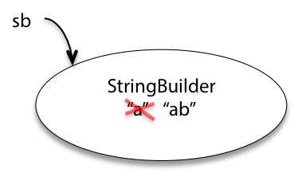
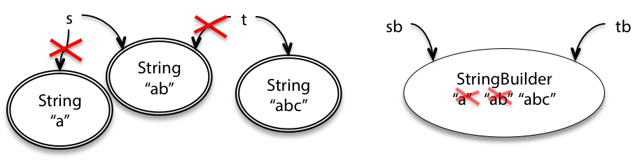
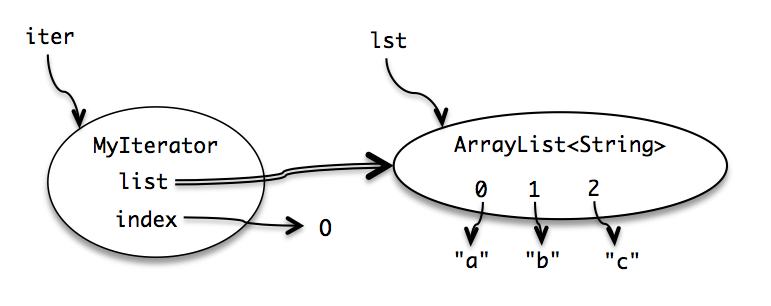

# Mutability & Immutability

## Mutability

Some objects are **immutable:** once created, they always represent the same value.

Other objects are **mutable:** they have methods that change the value of the object.

For example, `String` is an example of an immutable type. `StringBuilder` is an example of a mutable type. It has methods to delete parts of the string, insert or replace characters, etc.

```java
String s = "a";
s = s.concat("b") // s += "b". Actually, you create a new String object.
```


By contrast, `StringBuilder` objects are mutable. This class has methods that change the value of the object, rather than just returning new values:

```java
StringBuilder sb = new StringBuilder("a");
sb.append("b");
```



**There are big differences between how they behave when there are other references to the objects.**

```Java
String t = s;
t = t + "c";

StringBuilder tb  = sb;
tb.append("c");
```



Why do we need the mutable `StringBuilder` in programming? A common use for it is to concatenate a large number of strings together. Consider this code:

```java
String s = "";
for (int i = 0; i < b; ++ i) {
	s = s + n;
}
```

Using immutable strings, this makes a lot of temporary copies . It actually costs $O(n^2)$ time just to do all that copying, even though we only concatenated n elements.

`StringBuilder` is designed to minimize this copying. 

```java
StringBuilder sb = new StringBuilder();
for (int i = 0; i < n; ++i) {
	sb.append(String.valueOf(i));
}
String s = sb.toString(); //only copy at this step
```

- Good performance
- Convenient sharing

## Risks of mutation

`StringBuilder `should be able to do everything that `String `can do, plus `set() `and `append() `and everything else.

The answer is that **immutable types are safer from bugs, easier to understand, and more ready for change** . Mutability makes it harder to understand what your program is doing, and much harder to enforce contracts. 

> Java parameter passing: For primitive types (e.g. int, double...), the value is copied. For reference types (objects), the reference (i.e. the memory address) is copied. So changes to the object's fields affect the original object. But assigning a new object to the parameter does not change the original reference.

## Example 1: Passing mutable values

```java
/** @return the sum of the numbers in the list */
public static int sum(List<Integer> list) {
    int sum = 0;
    for (int x : list)
        sum += x;
    return sum;
}

/** @return the sum of the absolute values of the numbers in the list */
public static int sumAbsolute(List<Integer> list) {
    // let's reuse sum(), because DRY, so first we take absolute values
    for (int i = 0; i < list.size(); ++i)
        list.set(i, Math.abs(list.get(i)));
    return sum(list);
}
```

The method `sumAbsolute` does its job by **mutating the list directly.**

Passing mutable objects around is a latent bug.

## Example 2: Returning mutable values

Let’s consider [`Date `](https://docs.oracle.com/javase/8/docs/api/?java/util/Date.html), one of the built-in Java classes. `Date `happens to be a mutable type. Suppose we write a method that determines the first day of spring:

```java
/** @return the first day of spring this year */
public static Date startOfSpring() {
    return askGroundhog(); // 土拨鼠之日
}
```

Clients start using this method, for example to plan their big parties:

```java
// somewhere else in the code...
public static void partyPlanning() {
    Date partyDate = startOfSpring();
    // ...
}
```

All the code works and people are happy. Now, independently, two things happen. First, the implementer of `startOfSpring() `realizes that the groundhog is starting to get annoyed from being constantly asked when spring will start. So the code is rewritten to ask the groundhog at most once, and then cache the groundhog’s answer for future calls:

```java
/** @return the first day of spring this year */
public static Date startOfSpring() {
    if (groundhogAnswer == null) groundhogAnswer = askGroundhog();
    return groundhogAnswer;
}
private static Date groundhogAnswer = null;
```

(Aside: note the use of a private static variable for the cached answer. Would you consider this a global variable, or not?)

Second, one of the clients of `startOfSpring() `decides that the actual first day of spring is too cold for the party, so the party will be exactly a month later instead:

```java
// somewhere else in the code...
public static void partyPlanning() {
    // let's have a party one month after spring starts!
    Date partyDate = startOfSpring();
    partyDate.setMonth(partyDate.getMonth() + 1);
    // ... uh-oh. what just happened?
}
```

Now `partyDate` is just a reference to the same object as `groundhogAnswer`, not a copy. So modifying its month actually **modifies the cached original date**!

### Consequences of the Bug:

- `startOfSpring()` now returns a **mutated** date;
- Other parts of the code calling `startOfSpring()` will get the **incorrect, modified** date;
- The worst part: this bug **doesn’t appear immediately** — it might surface later, in a completely unrelated part of the code;
- **Who will discover this bug?** Not `startOfSpring()`, not `partyPlanning()`, but possibly some innocent third module.

### Solution

1. **Defensive Copying**: `return new Date(groundhogAnswer.getTime())`

   - Wasteful if 99% of clients never modify the returned date

2. Use Immutable Types (Recommended)

   "**Never use `Date` again!** Use classes from the `java.time` package instead:

   - `LocalDate`
   - `Instant`
   - `LocalDateTime`
      All of them are **immutable**, by design."

# Aliasing is what makes mutable types risky

What led to the problem in the two examples we just looked at was having multiple references, also called **aliases** , for the same mutable object.

## Specifications for mutating methods

Here’s an example of a mutating method:

```java
static void sort(List<String> lst)
  requires: nothing
  effects:  puts lst in sorted order, i.e. lst[i] <= lst[j]
              for all 0 <= i < j < lst.size()
```

And an example of a method that does not mutate its argument:

```java
static List<String> toLowerCase(List<String> lst)
  requires: nothing
  effects:  returns a new list t where t[i] = lst[i].toLowerCase()
```

If the *effects* do not explicitly say that an input can be mutated, then in 6.005 we assume mutation of the input is implicitly disallowed. Virtually all programmers would assume the same thing. Surprise mutations lead to terrible bugs.

## Iterating over arrays and lists

**iterator** — an object that steps through a collection of elements and returns the elements one by one. Iterators are used under the covers in Java when you’re using a [`for (... : ...) `loop ](https://ocw.mit.edu/ans7870/6/6.005/s16/classes/02-basic-java/#iteration)to step through a `List `or array. This code:

```java
List<String> lst = ...;
for (String str : lst) {
    System.out.println(str);
}
```

is rewritten by the compiler into something like this:

```java
List<String> lst = ...;
Iterator iter = lst.iterator();
while (iter.hasNext()) {
    String str = iter.next();
    System.out.println(str);
}
```

An iterator has two methods:

- `next() `returns the next element in the collection
- `hasNext() `tests whether the iterator has reached the end of the collection.

Note that the `next() `method is a **mutator** method, not only returning an element but also advancing the iterator so that the subsequent call to `next() `will return a different element.

### `final` keywords

| Use Case          | Meaning                         | Can it change?                  |
| ----------------- | ------------------------------- | ------------------------------- |
| `final` variable  | Value can't be reassigned       | ❌                               |
| `final` reference | Reference can't point elsewhere | ❌ (object can still be mutable) |
| `final` method    | Can't be overridden in subclass | ❌                               |
| `final` class     | Can't be extended/inherited     | ❌                               |

### `MyIterator`

- **Instance variables**: field.
- **constructor:** makes a new object instance and initializes its instance variables.
- **`this`**: refers to the **instance object**
- **private**: is used for the object's internal state and internal helper methods
- **final** is used to indicate which of the object's internal variables can be reassigned and which cannot.
  - For **primitive types**: A `final` variable **cannot change its value** once it is assigned.
  - For **reference types**: A `final` variable **cannot be reassigned** to point to a different object,
     but the **contents of the object it references can still be changed**.




> Iterator is an effective design pattern.
>
> Why iterator? The iterator concept allows a single uniform way to access different kinds of collections, so that client code is simpler and the collection implementation can change without changing the client code that iterates over it.

```java
/**
 * A MyIterator is a mutable object that iterates over
 * the elements of an ArrayList<String>, from first to last.
 * This is just an example to show how an iterator works.
 * In practice, you should use the ArrayList's own iterator
 * object, returned by its iterator() method.
 */
public class MyIterator {

    private final ArrayList<String> list;
    private int index;
    // list[index] is the next element that will be returned
    //   by next()
    // index == list.size() means no more elements to return

    /**
     * Make an iterator.
     * @param list list to iterate over
     */
    public MyIterator(ArrayList<String> list) {
        this.list = list;
        this.index = 0;
    }

    /**
     * Test whether the iterator has more elements to return.
     * @return true if next() will return another element,
     *         false if all elements have been returned
     */
    public boolean hasNext() {
        return index < list.size();
    }

    /**
     * Get the next element of the list.
     * Requires: hasNext() returns true.
     * Modifies: this iterator to advance it to the element 
     *           following the returned element.
     * @return next element of the list
     */
    public String next() {
        final String element = list.get(index);
        ++index;
        return element;
    }
}
```

## Mutation undermines an iterator

```java
public static void dropCourse6(ArrayList<String> subjects) {
    MyIterator iter = new MyIterator(subjects);
    while (iter.hasNext()) {
        String subject = iter.next();
        if (subject.startsWith("6.")) {
            subjects.remove(subject);
        }
    }
}
```

The test case fails:

```
// dropCourse6(["6.045", "6.005", "6.813"])
//   expected [], actual ["6.005"]
```

This is because you change the `subjects` during the iteration. Moreover, the built-in iterator in `ArrayList` suffers from the same problem. 

```java
for (String subject : subjects) {
    if (subject.startsWith("6.")) {
        subjects.remove(subject);
    }
}
```

then you’ll get a [`Concurrent­Modification­Exception `](https://docs.oracle.com/javase/8/docs/api/?java/util/ConcurrentModificationException.html)

> 你在迭代集合的过程中同时修改了集合（非通过迭代器自身），导致迭代器状态不一致，从而抛出异常。

The built-in iterator detects that you’re changing the list under its feet, and cries foul. 

How can you fix this problem? One way is to use the `remove()` method of `Iterator`, so that the iterator adjusts its index appropriately:

```java
Iterator iter = subjects.iterator();
while (iter.hasNext()) {
    String subject = iter.next();
    if (subject.startsWith("6.")) {
        iter.remove();
    }
}
```

If you're **iterating over a collection**, and need to **remove elements**:

> **Always use the iterator’s `remove()` method** — not the collection’s `remove()` method

## Mutation and contracts

### Mutable objects can make simple contracts very complex

Multiple references to the same mutable object (also called **aliases** for the object)  create global dependencies.

- Contracts are no longer **enforced locally** (e.g. between client and implementer)
- Every reference holder must behave properly to maintain consistency

### Mutable objects reduce changeability

Mutable objects make the contracts between clients and implementers more complicated, and reduce the freedom of the client and implementer to change.

## Useful immutable types

Since immutable types avoid so many pitfalls, let’s enumerate some commonly-used immutable types in the Java API:

- The primitive types and primitive wrappers are all immutable. If you need to compute with large numbers, [`BigInteger `](https://docs.oracle.com/javase/8/docs/api/?java/math/BigInteger.html)and [`BigDecimal `](https://docs.oracle.com/javase/8/docs/api/?java/math/BigDecimal.html)are immutable.

- Don’t use mutable `Date `s, use the appropriate immutable type from [`java.time `](https://docs.oracle.com/javase/8/docs/api/index.html?java/time/package-summary.html)based on the granularity of timekeeping you need.

- The usual implementations of Java’s collections types — `List `, `Set `, `Map `— are all mutable: `ArrayList `, `HashMap `, etc. The [`Collections `](https://docs.oracle.com/javase/8/docs/api/?java/util/Collections.html)utility class has methods for obtaining *unmodifiable views* of these mutable collections:

  - `Collections.unmodifiableList`
  - `Collections.unmodifiableSet`
  - `Collections.unmodifiableMap`

  You can think of the unmodifiable view as a wrapper around the underlying list/set/map. A client who has a reference to the wrapper and tries to perform mutations — `add `, `remove `, `put `, etc. — will trigger an [`Unsupported­Operation­Exception `](https://docs.oracle.com/javase/8/docs/api/?java/lang/UnsupportedOperationException.html).

  Before we pass a mutable collection to another part of our program, we can wrap it in an unmodifiable wrapper. We should be careful at that point to forget our reference to the mutable collection, lest we accidentally mutate it. (One way to do that is to let it go out of scope.) Just as a mutable object behind a `final `reference can be mutated, the mutable collection inside an unmodifiable wrapper can still be modified by someone with a reference to it, defeating the wrapper.

- `Collections `also provides methods for obtaining immutable empty collections: `Collections.emptyList `, etc. Nothing’s worse than discovering your *definitely very empty* list is suddenly *definitely not empty* !

## Summary

Make sure you understand the difference 

- immutable object (e.g. `String`)
- immutable reference (e.g. `final` variable)

**Always use the iterator’s `remove()` method** — not the collection’s `remove()` method

Snapshot diagrams can help with this understanding.

- Objects are values, represented by circles in a snapshot diagram, and an immutable one has a double border indicating that it never changes its value.
- A reference is a pointer to an object, represented by an arrow in the snapshot diagram, and an immutable reference is an arrow with a double line, indicating that the arrow can’t be moved to point to a different object.

The key design principle here is **immutability**: using immutable objects and immutable references as much as possible!!!

Use **defensive copying** to **protect the internal state of an object** by creating a **copy** of any mutable objects passed into or returned from a class instead of using or exposing the original reference.
